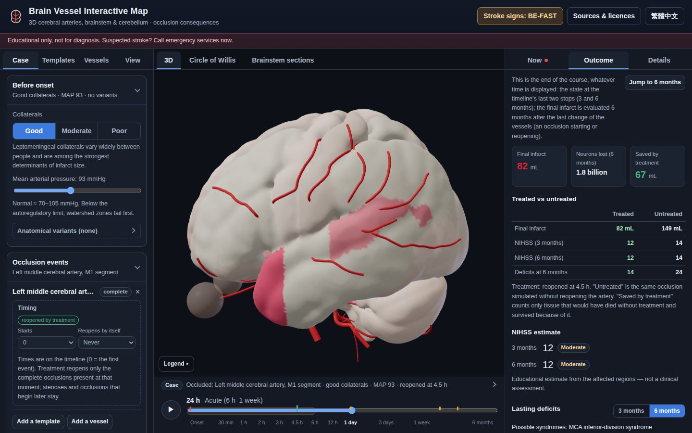
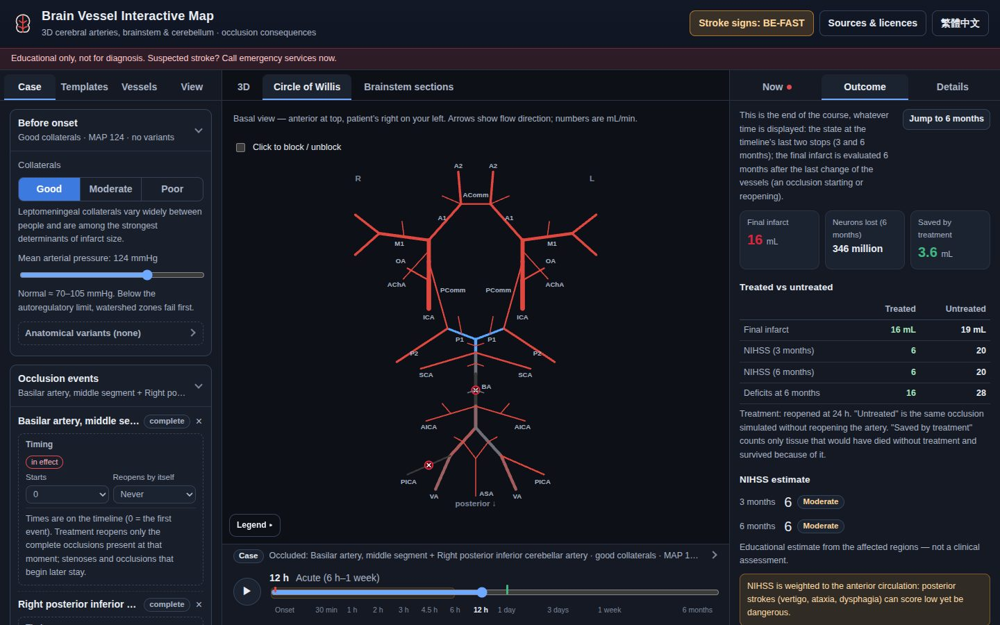
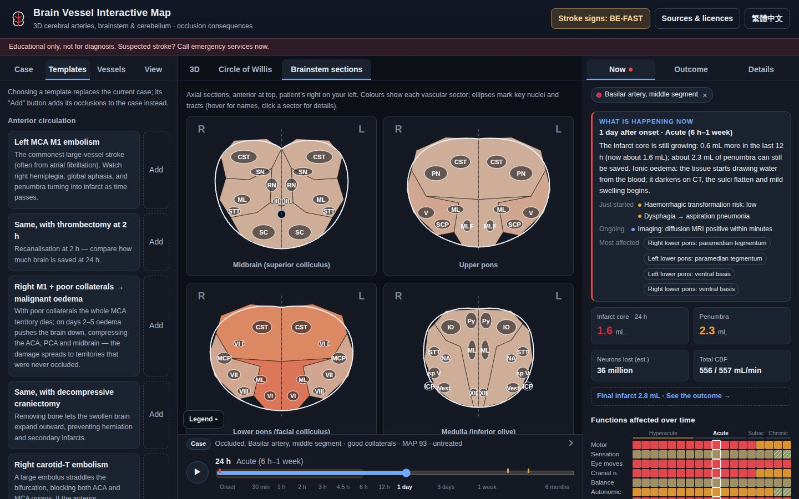

# Brain Vessel Interactive Map · 腦血管互動地圖

[繁體中文](README.md) · **English**

[](https://github.com/LZong-tw/brain-vessel-map/actions/workflows/ci.yml)
[](https://github.com/LZong-tw/brain-vessel-map/actions/workflows/deploy.yml)
[](LICENSE)
[](public/data/LICENSE.txt)

The arteries of the cerebrum, cerebellum and brainstem on a real MNI template brain. Block one or more vessels (or
release an embolus) and follow what happens to **other** brain regions **from minutes to months**: penumbra turning
into infarct, oedema and mass effect, herniation, hydrocephalus, remote degeneration… — which regions and which
**functions** are failing, still salvageable or recovering at each moment, and what is left at the end of the course.

**Live:** <https://lzong-tw.github.io/brain-vessel-map/> (GitHub Pages has to be enabled first, see *Deploying* below)



> ⚠️ **Educational only — not a diagnostic tool.** The model uses a "standard brain" and simplified rules, not anyone's own brain.
> Suspected stroke: call emergency services now (face drooping, arm weakness, speech difficulty — note the time it started).
>
> **教育用途，不能用於診斷。** 懷疑中風請立刻撥 **119**。

---

## How to use it

1. **Pick a starting point**: load a teaching case from *Templates* (e.g. left M1 embolism, locked-in syndrome), or press "+ Block" on any artery in *Vessels*. A template's *Add* button and a vessel's "+ Block" **add to** the current case, so several arteries can be combined (e.g. mid-basilar + right PICA).
2. **Shape the case**: the *Case* tab has three cards — *Before onset* (collaterals, blood pressure, circle-of-Willis variants), *Occlusion events* (the degree and timing of each vessel, e.g. a TIA first and complete occlusion three days later) and *Treatment* (when, how and how well the artery is reopened; decompressive surgery). A closed card still shows a one-line summary, and a line above the timeline summarises the whole case.
3. **Move along the timeline** from onset to 6 months. *Now* shows the tissue, symptoms, NIHSS and events at that moment; *Outcome* shows how the course ends (and, with a treatment set, compares it with the same occlusion left closed); *Details* shows the selected vessel or region.
4. **Share**: the whole case lives after the `#` in the address — copy the URL.

## Features

| | |
|---|---|
| **Real anatomy** | Cerebral hemispheres, cerebellum, brainstem, thalamus, basal ganglia, internal capsule, corpus callosum, dentate nucleus, ventricles — 3D surfaces generated from the MNI ICBM152 2009c template, not hand-modelled shapes. |
| **180 arterial segments** | Aortic arch → carotid / vertebral arteries → circle of Willis → cortical branches, lenticulostriates, choroidal arteries, brainstem perforators, PICA / AICA / SCA; 38 of them are leptomeningeal / extracranial collaterals. Main trunks are fitted to a multi-centre MRA statistical atlas. 125 functional regions, 268 "region × territory" units. |
| **Blood-flow model** | A Poiseuille resistance network gives the flow and its direction in every vessel: circle-of-Willis reversal, subclavian steal, autoregulation, watershed ischaemia at low pressure, and 15 anatomical variants (fetal PCA, absent AComm / PComm, persistent trigeminal artery…; the default complete circle of Willis is a minority anatomy in adults). The brainstem also has undrawn leptomeningeal collaterals whose conductance depends on blood pressure, and the subclavian arteries have undrawn chest-wall and neck collaterals. |
| **Case → Now → Outcome** | The *Case* tab gathers every setting of a case, *Templates* loads or adds teaching cases; on the right, *Now* is the displayed moment and *Outcome* the end of the course: final infarct, NIHSS at 3 and 6 months, lasting deficits and how far they are compensated, late complications. |
| **Timeline** | Onset → 15, 30 min → 1, 2, 3, 4.5, 6, 12 h → 1, 2, 3, 5 days → 1, 2 weeks → 1, 3, 6 months. *Now* and *Details* follow the timeline: tissue state, how long until the penumbra is lost, which functions are impaired / at risk / recovered, and a heat-map of the whole course (click any cell for that moment's symptoms, source regions and changes). |
| **Staged course** | Each vessel can start and reopen by itself at chosen times, or "become a complete occlusion later": transient ischaemic attacks (TIA), a stenosis that later occludes (e.g. herald TIAs → basilar occlusion days later), and treatment at any point. |
| **Recanalisation details** | Method (thrombectomy / IV thrombolysis / bridging), reperfusion grade (eTICI 0–3), reocclusion, clot fragments embolising a distal branch or a new territory (same-side ACA), no-reflow (limited evidence). The simulation shows the result you choose; next to it are published figures by occlusion site (recanalisation, symptomatic haemorrhage — with their own figures for medium/distal vessels and for large-core thrombectomy — tenecteplase, imaging-selected thrombolysis beyond 4.5 h, reocclusion, distal and new-territory emboli, no-reflow), each with its source, and warnings about the thrombolysis / thrombectomy windows by site (e.g. basilar thrombolysis beyond 4.5 h rests on expert consensus only, sites no thrombectomy trial tested, the negative medium-vessel trials). The course's *treatment windows* also follow the occlusion site: anterior large vessel (with the large-core trials), basilar (with trial mortality), isolated cervical ICA, V4, medium/distal vessels and lacunar strokes. "Saved" counts only tissue that would have died without treatment and survives because of it. |
| **Recovery** | Early deficits exceed the infarct (oedema and remote depression silence living tissue), then spared pathways take over part of the function: more for one-sided lesions and functions with bilateral or parallel supply, none for "final common path" nuclei such as cranial-nerve nuclei, and very little when both sides of the ventral pons are cut, where the main pathways and their backups run together. Illustrative population averages, not a prognosis. |
| **Oedema and swelling** | Cytotoxic oedema (DWI, minutes) → ionic oedema (CT hypodensity, hours) → vasogenic oedema (peak on days 3–5) → resolution → atrophy (months); the 3D brain deforms with each region's swelling (exaggerate 1× / 3× / 5× to see it), plus an "oedema / imaging" colour mode; midline shift and ventricular compression or enlargement over time. |
| **Cascade (effects on other regions)** | Malignant MCA oedema → subfalcine herniation (ACA compression) and uncal herniation (midbrain, PCA); cerebellar swelling → obstructive hydrocephalus; haemorrhagic transformation risk; crossed cerebellar diaschisis; Wallerian degeneration of the pyramidal tract; hypertrophic olivary degeneration and palatal tremor; thalamic atrophy; aspiration pneumonia, arrhythmia, seizures, depression… |
| **Clinical output** | Expected symptoms (by system and side), named syndromes (Wallenberg, Weber / Benedikt, Foville, locked-in, Percheron, Gerstmann, lacunar… 39 rules), an NIHSS estimate (with a warning that posterior-circulation strokes score low, and a note when the score is 0 but there are symptoms the scale does not count). |
| **Non-motor functions** | Appearing with the damaged sites and following the timeline: sleep (REM sleep behaviour disorder, central sleep apnoea, lasting hypersomnia), emotional expression (pathological crying/laughing), temperature regulation and sweating (reduced sweating on the lesion side, excess sweating on the opposite side, a colder paralysed limb), loss of taste, urinary retention; each has its own row in the function heat-map. The *Outcome* tab also lists problems that are common after stroke but weakly tied to the lesion site (depression, anxiety, apathy, emotionalism, fatigue, insomnia, sleep apnoea, dementia) with their population prevalence and sources — the model cannot predict them for the case, and they are not counted as symptoms or in the NIHSS. |
| **Three views** | 3D (clipping, opacity, one hemisphere only), a circle-of-Willis diagram (live flow and direction, click to block), and vascular territories on four brainstem sections. |
| **Embolus** | Choose the source (heart, right / left carotid plaque, right / left vertebral) and size; the embolus drifts by branch flow and lodges in the first vessel narrower than itself — large emboli mostly in the ICA terminus or M1, small ones in cortical branches. |
| **31 teaching templates** | Left M1, thrombectomy comparison, malignant oedema and decompression, carotid T occlusion, Broca / Wernicke, ACA, AChA, striatocapsular infarct, capsular and pontine lacunes, thalamus, Percheron, PCA, top of the basilar, locked-in, Wallenberg, PICA with hydrocephalus, AICA, SCA → palatal tremor, Dejerine, carotid stenosis, watershed, steal, amaurosis fugax, TIA, progressive basilar thrombosis… |
| **Other** | Traditional Chinese / English (interface and all anatomy, symptom and event texts), shareable URLs, phone layout, BE-FAST stroke-sign guide. |

| Circle of Willis and *Outcome* | Brainstem sections and *Now* |
|---|---|
|  |  |

## How the simulation works

1. **Geometry**: `tools/build_assets.py` downloads MNI152NLin2009cAsym segmentations and probability maps from TemplateFlow and meshes them with marching cubes; every surface point is labelled with a functional region and an arterial territory (a *bed*). Territories come from the Liu et al. arterial atlas; where they overlap is the watershed.
2. **Blood flow**: every vessel is a Poiseuille resistance; each bed is shared by one or more supplying arteries; collaterals conduct according to their grade (good / moderate / poor); arterioles dilate as perfusion pressure falls (autoregulation, up to 1.8×). The brainstem also has undrawn leptomeningeal collaterals, which constrict when blood pressure is above normal; the subclavian arteries have undrawn chest-wall and neck collaterals, which feed the arm together with the reversed vertebral artery when the subclavian is blocked proximally. A vessel only some people have (a persistent trigeminal artery) exists only when its variant is chosen, and vessels a variant removes are not drawn. A linear system gives the pressure and flow everywhere.
3. **Staged course**: occlusions can start at different times, reopen by themselves or progress, and treatment can reocclude or send fragments downstream; the flow is solved once for every stretch in which the occlusions stay the same, and the tissue follows that flow history. Time 0 is the first event; the cascade, oedema and recovery run from the occlusion that causes most of the infarct (without an infarct, from the first one that makes tissue ischaemic).
4. **Tissue fate**: relative flow < 30 % is ischaemic core (loss starts after about 6 minutes and most of it is gone within a quarter of an hour), 30–55 % is penumbra (the lower, the faster it dies; without reopening at most 85 % of it survives on collaterals), 55–85 % is mild oligaemia. The retina starts to die only after about 12 minutes of complete occlusion (a human estimate; monkey experiments give much longer), so amaurosis fugax lasting minutes leaves no infarct. The brainstem penumbra dies more slowly and survives less often without treatment — a calibration to the basilar thrombectomy trials (ATTENTION, BAOCHE). The final infarct is evaluated 6 months after the last change to the vessels.
5. **Treatment**: reopens the complete occlusions present at the chosen time. The reperfusion grade (eTICI) sets the share of the territory that follows the reopened course; the rest follows the untreated one. No-reflow, reocclusion and distal emboli each modify that course. "Saved" = tissue that would have infarcted untreated and survives treated.
6. **Oedema**: each bed accumulates cytotoxic, ionic and vasogenic oedema and later atrophy from its core, penumbra and reperfusion; the swelling volume becomes a midline shift (mostly outward after decompressive craniectomy).
7. **Cascade**: simplified thresholds from the literature (e.g. > 145 mL infarct within 14 h → malignant oedema; cerebellar infarct > 25 mL → hydrocephalus risk) project consequences onto regions that were **not** occluded.
8. **Symptoms, syndromes and recovery**: every region lists the symptoms of its loss (ipsi- or contralateral); these are combined and matched against named-syndrome rules. Early on, oedema and remote depression add temporary dysfunction; later, each function is compensated according to how much backup it has.

Code: `src/engine/` (solver → hemodynamics → schedule / treatment → tissue → edema / cascade → recovery → clinical → simulate); anatomy data: `src/anatomy/`.

## Honest limitations

- **The blood flow is a 0-D lumped model**: no pulsatility, no viscosity changes, no real 3D fluid dynamics. The numbers (mL/min) are meaningful only in order of magnitude and direction.
- **Thresholds and time constants are simplified from the literature and hand-calibrated** to show the right *trends* (worse collaterals → larger infarcts, earlier reopening → more saved, low NIHSS in posterior strokes…), not to predict anyone's infarct volume.
- **Oedema magnitude and timing are teaching approximations**: every bed uses the same curves while real people differ widely; the 3D deformation only pushes along surface normals (no tissue mechanics), and the exaggeration exists only to make it visible.
- Small vessels (cortical perforators, small brainstem branches) are **schematic**; only the main trunks are fitted to the statistical atlas. Surface arteries and collaterals are drawn above the surface with its sulci closed, so they don't keep sinking under the cortex; this changes only the picture — the flow model still uses the original vessel lengths.
- **The brain meshes have a few small gaps**: gaps of a few millimetres along the midline between the hemispheres and between the brainstem and cerebellum let short stretches of the third and fourth ventricles show from some angles (at most about 4 mm). A gap of about 3 mm is left on purpose between the hemispheres and the cerebellum (where the tentorium lies), and the branches of the superior cerebellar artery (SCA) run in it; to make room, the drawn lower surface of the occipital and temporal lobes is about 2 mm thinner at the junction (at most about 6 mm) — region volumes and the flow model are unaffected. As in a real brain, the top of the cerebellum is mostly covered by the occipital lobe: to see a whole SCA, hide that hemisphere or lower the cortex opacity under *View*.
- Symptoms, syndromes and the NIHSS are **inferred from the damaged regions**; real presentations vary widely. Haemorrhagic stroke, venous sinus thrombosis, vasculitis and the like are **not** simulated.
- **The effect of blood pressure is a model assumption**: in the model a higher pressure pushes more blood through the collaterals and shrinks the infarct (very sensitive around the default 93 mmHg), and high pressure does no harm of its own; in acute stroke both high and low pressure are associated with worse outcome, and raising pressure with drugs is supported only by small trials. From a mean pressure of 120 mmHg the course notes this evidence and the blood-pressure limit before thrombolysis.
- **The posterior-circulation time window is a calibration**: the brainstem leptomeningeal collaterals and the slower brainstem penumbra were set to match the trends of the basilar thrombectomy trials (ATTENTION, BAOCHE); their pathways and parameters are model assumptions, not measurements.
- **The non-motor symptoms rest on evidence of uneven strength**: where REM sleep behaviour disorder, sweating changes, taste loss and pathological crying come from rests mostly on case series and small studies, and their severities are illustrative. The hypothalamus is not in the model, so its own temperature set-point, circadian rhythm, appetite and hormones are not simulated; nor is central fever (early fever after an ischaemic stroke is mostly infection, and central fever in the literature is mostly after haemorrhage). The population prevalences on the *Outcome* tab are not predictions for the case.
- **Recovery and compensation are illustrative**: population-average curves by function and by one- or two-sided damage, with no rehabilitation intensity, age or comorbidity; they cannot estimate anyone's recovery.
- **Recanalisation details are illustrative**: partial reperfusion is approximated as that share of the territory regaining flow, with no microvascular model; a lasting reocclusion ends at the untreated final infarct (only later); the evidence on no-reflow is limited; the published figures are for reference and do not drive the simulation. The thrombolytic drug (alteplase or tenecteplase) does not change the simulation; the time chosen is when flow returns, not when the drug is started; a lacunar (single-branch) occlusion is not reopened by treatment.
- **The *Outcome* tab runs the same model twice**: "untreated" is the same occlusion without reopening, not a real-world control group; 3 and 6 months are the timeline's two last stops (counted from the first event) — a very late occlusion is flagged as "not settled at 6 months", but the late events and final regions are not re-evaluated later. The thresholds that group deficits into "still marked / partly compensated / largely compensated" (25 %, 60 %) are chosen for readability.
- **Not for judging real cases in hindsight** (e.g. "would thrombectomy have changed things?"): the model is a standard brain with average parameters, so the answer reflects only its assumptions.
- The medical content was compiled by the developer from textbooks and papers and **has not been formally reviewed by clinicians**. Please open an issue for any error.

## Development

```bash
npm install
npm run dev        # http://localhost:5173
npm test           # engine, component (jsdom), documentation and output-invariant tests: every rule can fire, treatment never enlarges the infarct, symptoms don't flicker, the numbers in the docs match the data…
npm run lint && npm run typecheck
npm run build      # outputs dist/ with relative paths, deployable in any sub-directory
```

### Regenerating the anatomy assets

`public/data/brain.{json,bin}` and `src/anatomy/generated/*.json` are committed; normal development does not rebuild them.
After changing `src/anatomy/` (vessels, regions):

```bash
python3 -m pip install -r tools/requirements.txt
npm run assets:build    # = vite-node tools/export-anatomy.ts && python3 tools/build_assets.py
```

The first run downloads about 80 MB of public atlases into `tools/.cache/` (git-ignored); it takes about a minute.

## Deploying to GitHub Pages

1. In the repository, set **Settings → Pages → Build and deployment → Source** to **GitHub Actions** (once).
2. Merge into `main` (or run *Deploy to GitHub Pages* manually from the Actions tab).
3. `.github/workflows/deploy.yml` runs the tests, builds and publishes `dist/` at `https://<user>.github.io/<repo>/`.

Vite's `base` is `'./'`, so every asset path is relative: renaming the repository or using a custom domain needs no change,
and the state lives after the `#`, so no server routing is needed.

## Project layout

```
src/
  anatomy/     vessels, regions, symptoms, syndromes, variants, templates, timeline, recanalisation evidence, sources (sources.ts)
    generated/ produced by tools/build_assets.py (bed volumes, fitted vessel paths, drawn vessel paths)
  engine/      solver → hemodynamics → schedule / treatment → tissue → edema / cascade → recovery → clinical → simulate; embolus
  scene/       react-three-fiber 3D scene
  components/  panels (case, templates, vessels, now, outcome, details), timeline, circle-of-Willis and brainstem diagrams
  ui/          pure functions for the interface (case summary, outcome, treatment options, formatting), each unit-tested
  state/       zustand store, URL sync
  i18n/        interface strings (Traditional Chinese / English), one file per feature
tools/         asset pipeline (Python) and anatomy export
public/data/   brain meshes (binary)
docs/          screenshots
```

## Sources & licences

- **Code**: MIT ([`LICENSE`](LICENSE)).
- **Derived data** (`public/data/`, `src/anatomy/generated/`): **CC BY-SA 4.0** ([`public/data/LICENSE.txt`](public/data/LICENSE.txt)), because it contains material derived from the CC BY-SA 4.0 arterial territory atlas.
- Public data used: MNI ICBM152 2009c template (McGill copyright notice), Mindboggle DKT31 cortical parcellation (CC BY 4.0), MIAL67 thalamic nuclei atlas (CC BY 4.0), Liu et al. arterial territory atlas (CC BY-SA 4.0), Mouches & Forkert statistical atlas of cerebral arteries (CC0).
- Open-source projects consulted, **no code copied**: openBF, WillisWorks (GPL-3.0, concepts only), neuroaxis-atlas, brain-game.

Full notices, citation formats and modifications are in [`THIRD_PARTY_NOTICES.md`](THIRD_PARTY_NOTICES.md), the literature in [`REFERENCES.md`](REFERENCES.md),
plans and completed work in [`ROADMAP.md`](ROADMAP.md). The in-app "Sources & licences" dialog lists the same.
