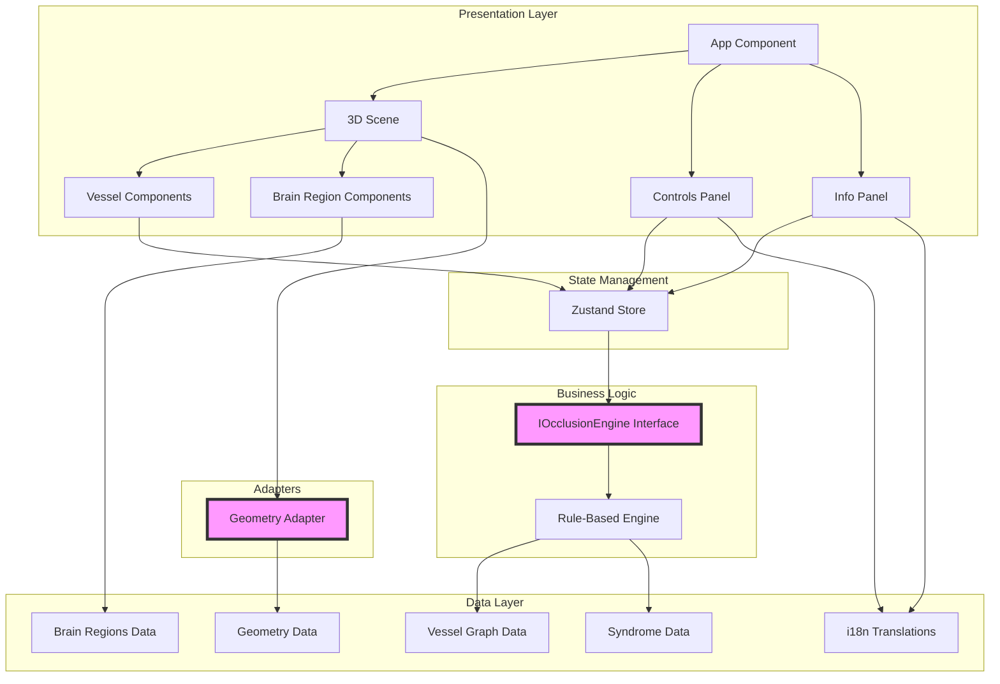

# 腦血管互動地圖 / Brain Vessel Interactive Map

[](https://github.com/yourusername/brain-vessel-map/actions)
[](https://opensource.org/licenses/MIT)

教育用途的互動式 3D 腦血管系統視覺化工具，面向一般民眾（繁體中文為主）。

An interactive 3D cerebrovascular system visualization for educational purposes, aimed at ordinary people (Traditional Chinese primary audience).


## ⚠️ 重要免責聲明 / Important Disclaimer

**本工具僅供教育用途，不可用於醫療診斷。**  
**任何中風症狀都需要立即撥打 119 求救！**

**This tool is for educational purposes only and not for medical diagnosis.**  
**Call emergency services immediately for any stroke symptoms!**

中風徵兆：**F**ace 臉歪、**A**rm 手垂、**S**peech 說話不清楚、**T**ime 時間就是腦細胞，趕快送醫！

## ✨ 功能特色 / Features

- 🧠 **互動式 3D 視覺化**: 使用 Three.js 和 React Three Fiber 建構
- 🩸 **完整的血管圖譜**: ICA、ACA、MCA、PCA、椎基底動脈系統、Willis 環
- 🎯 **阻塞模擬**: 點選血管模擬阻塞，即時顯示影響區域
- 🔄 **側枝循環模擬**: 自動評估 AComm、PComm 的救援效果
- 📊 **具名症候群**: 識別華倫堡氏症候群、MCA 症候群等
- 🌐 **雙語支援**: 繁體中文為預設，已準備英文支援
- 🧪 **完整測試**: 包含單元測試和 CI/CD
- 🔌 **可擴展架構**: 介面卡模式便於替換幾何和引擎

## 🏗️ 架構概覽 / Architecture Overview



### 關鍵設計模式 / Key Design Patterns

1. **介面卡模式 (Adapter Pattern)**:
   - `IOcclusionEngine`: 可替換的阻塞引擎介面
   - `GeometryAdapter`: 可替換的幾何提供者（目前是程序化，可換成真實網格）

2. **關注點分離 (Separation of Concerns)**:
   - 資料模型 (`src/data/`) 與渲染邏輯分離
   - 臨床邏輯集中在資料檔案中，不硬編碼在引擎裡

3. **純函式 (Pure Functions)**:
   - `OcclusionEngine.calculateOcclusion()` 是無副作用的純函式
   - 便於單元測試和推理

## 🚀 快速開始 / Quick Start

### 系統需求 / Prerequisites

- Node.js 20+ 
- npm 或 yarn

### 安裝與執行 / Installation & Running

```bash
# 複製儲存庫
git clone https://github.com/yourusername/brain-vessel-map.git
cd brain-vessel-map

# 安裝依賴
npm install

# 開發伺服器
npm run dev

# 執行測試
npm test

# 型別檢查
npm run typecheck

# Lint 檢查
npm run lint

# 建置生產版本
npm run build
```

開啟 http://localhost:5173 即可看到應用程式。

Open http://localhost:5173 to see the application.

## 📖 操作指南 / How-To Guides

### 如何新增一條血管 / How to Add a Vessel

1. **更新資料模型** (`src/data/vessels.ts`):

```typescript
export const vessels: Record<string, Vessel> = {
  // ... 現有的血管
  new_vessel: {
    id: 'new_vessel',
    nameZh: '新血管名稱',
    nameEn: 'New Vessel Name',
    suppliesRegions: ['region_id_1', 'region_id_2'],
    parentId: 'parent_vessel_id', // 可選
    childIds: ['child_vessel_id'], // 可選
    collateralIds: [], // 如果是側枝循環的一部分
  },
};
```

2. **新增幾何資料** (`src/data/vesselGeometry.ts`):

```typescript
export const vesselGeometry: Record<string, VesselGeometry> = {
  // ... 現有的幾何
  new_vessel: {
    points: createSplinePath([x1, y1, z1], [x2, y2, z2]),
    radius: 0.1,
  },
};
```

3. **新增標記**: `// TODO(medical-review): 描述和來源`

4. **執行測試**: `npm test` 確保整合正確

### 如何新增一個腦區 / How to Add a Brain Region

1. **更新腦區資料** (`src/data/regions.ts`):

```typescript
export const brainRegions: Record<string, BrainRegion> = {
  // ... 現有的腦區
  new_region: {
    id: 'new_region',
    nameZh: '新腦區名稱',
    nameEn: 'New Region Name',
    descriptionZh: '一般人能理解的功能說明',
    category: 'cerebrum', // 或 'cerebellum', 'brainstem'
  },
};
```

2. **新增幾何資料** (`src/data/vesselGeometry.ts`):

```typescript
export const regionGeometry: Record<string, ...> = {
  // ... 現有的幾何
  new_region: {
    position: [x, y, z],
    size: [width, height, depth],
  },
};
```

3. **更新血管供應**: 在相關血管的 `suppliesRegions` 中加入 `'new_region'`

### 如何新增一個症候群規則 / How to Add a Syndrome Rule

1. **更新症候群資料** (`src/data/syndromes.ts`):

```typescript
export const syndromes: Syndrome[] = [
  // ... 現有的症候群
  {
    id: 'new_syndrome',
    nameZh: '症候群中文名稱',
    nameEn: 'Syndrome English Name',
    descriptionZh: '一般人能理解的症狀描述',
    triggerVessels: ['vessel_id_1', 'vessel_id_2'],
  },
];
```

2. **更新引擎邏輯** (`src/engine/OcclusionEngine.ts`):

在 `identifySyndrome()` 方法中新增識別邏輯：

```typescript
private identifySyndrome(blockedVesselIds: string[]): ... {
  // ... 現有的規則
  
  if (blockedVesselIds.some(id => ['vessel_id_1', 'vessel_id_2'].includes(id))) {
    return {
      nameZh: '症候群中文名稱',
      nameEn: 'Syndrome English Name',
      descriptionZh: '症狀描述',
    };
  }
}
```

3. **新增測試案例**:

```typescript
describe('New syndrome', () => {
  it('should identify the syndrome', () => {
    const result = engine.calculateOcclusion(['vessel_id_1'], vessels);
    expect(result.syndrome?.nameEn).toBe('Syndrome English Name');
  });
});
```

### 如何替換成真實 3D 網格 / How to Swap in Real 3D Meshes

目前的幾何是程序化佔位符。要使用真實解剖網格（如 BodyParts3D）：

1. **準備模型檔案**:
   - 下載或建立 GLB/GLTF 格式的 3D 模型
   - 放置在 `public/models/` 目錄

2. **安裝 GLB 載入器** (已包含在 drei):

```typescript
import { useGLTF } from '@react-three/drei';
```

3. **建立新的幾何提供者**:

在 `src/components/` 建立 `RealMeshVessel.tsx`:

```typescript
import { useGLTF } from '@react-three/drei';

export function RealMeshVessel({ vesselId, modelPath, ... }) {
  const { scene } = useGLTF(modelPath);
  
  return (
    <primitive 
      object={scene.clone()} 
      onClick={...}
      // ... 其他互動邏輯
    />
  );
}
```

4. **更新 Scene 元件**:

在 `src/components/Scene.tsx` 中替換 `Vessel` 元件為 `RealMeshVessel`。

5. **保持介面一致**:

確保新元件接受相同的 props (`vesselId`, `name`) 以保持互換性。

### 如何替換阻塞引擎 / How to Replace the Occlusion Engine

目前使用 `RuleBasedOcclusionEngine`。要換成更進階的模型：

1. **實作 IOcclusionEngine 介面**:

建立 `src/engine/AdvancedOcclusionEngine.ts`:

```typescript
import { IOcclusionEngine } from './OcclusionEngine';

export class AdvancedOcclusionEngine implements IOcclusionEngine {
  calculateOcclusion(
    blockedVesselIds: string[],
    vessels: Record<string, Vessel>
  ): OcclusionResult {
    // 你的進階邏輯（圖論、機率模型等）
    // ...
    
    return {
      affectedRegionsFull: [...],
      affectedRegionsPartial: [...],
      consequencesZh: '...',
      syndrome: {...},
    };
  }
}
```

2. **更新 Store**:

在 `src/store/appStore.ts` 中：

```typescript
import { AdvancedOcclusionEngine } from '../engine/AdvancedOcclusionEngine';

const occlusionEngine = new AdvancedOcclusionEngine();
```

3. **執行測試**: 確保通過所有現有測試案例

4. **新增特定測試**: 為新引擎的特殊行為新增測試

## 🧪 測試 / Testing

### 執行測試 / Running Tests

```bash
# 單次執行所有測試
npm test

# 監視模式
npm run test:watch
```

### 測試覆蓋率 / Test Coverage

目前的測試涵蓋：
- ✅ MCA 阻塞案例
- ✅ PICA 阻塞（華倫堡氏症候群）
- ✅ 基底動脈阻塞
- ✅ 透過 AComm 的側枝循環救援
- ✅ 透過 PComm 的側枝循環救援
- ✅ 資料一致性檢查

## 🌐 國際化 / Internationalization

目前支援：
- 繁體中文 (zh-TW) - 預設
- 英文 (en) - 已準備

新增新語言：

1. 在 `src/i18n/translations.ts` 中新增翻譯
2. 更新 `Language` 型別
3. 在 UI 中新增語言選擇器選項

## 📁 專案結構 / Project Structure

```
brain-vessel-map/
├── .github/
│   └── workflows/
│       └── ci.yml              # GitHub Actions CI
├── src/
│   ├── components/             # React 元件
│   │   ├── App.tsx
│   │   ├── Scene.tsx          # 3D 場景
│   │   ├── Vessel.tsx         # 血管元件
│   │   ├── BrainRegion.tsx    # 腦區元件
│   │   ├── Controls.tsx       # 控制面板
│   │   └── InfoPanel.tsx      # 資訊面板
│   ├── data/                  # 資料模型
│   │   ├── vessels.ts         # 血管圖譜 (TODO: medical-review)
│   │   ├── regions.ts         # 腦區資料 (TODO: medical-review)
│   │   ├── syndromes.ts       # 症候群資料 (TODO: medical-review)
│   │   └── vesselGeometry.ts  # 幾何資料 (TODO: medical-review)
│   ├── engine/                # 阻塞引擎
│   │   ├── OcclusionEngine.ts # 引擎介面與實作
│   │   └── OcclusionEngine.test.ts # 單元測試
│   ├── i18n/                  # 國際化
│   │   └── translations.ts
│   ├── store/                 # 狀態管理
│   │   └── appStore.ts        # Zustand store
│   ├── types/                 # TypeScript 型別
│   │   └── vessel.ts
│   ├── main.tsx               # 入口點
│   └── App.css                # 樣式
├── index.html                 # HTML 模板
├── package.json               # 依賴與腳本
├── tsconfig.json              # TypeScript 設定
├── vite.config.ts             # Vite 設定
├── .eslintrc.cjs              # ESLint 設定
├── LICENSE                    # MIT 授權
├── README.md                  # 本檔案
├── ROADMAP.md                 # 開發路線圖
└── REFERENCES.md              # 參考資源
```

## 🤝 貢獻 / Contributing

我們歡迎各種形式的貢獻！

We welcome contributions of all kinds!

- 🐛 回報 Bug / Report bugs
- 💡 提出功能建議 / Suggest features
- 📝 改進文件 / Improve documentation
- 🩺 審查醫學內容 / Review medical content
- 🌐 新增翻譯 / Add translations
- 🎨 貢獻 3D 模型 / Contribute 3D models

請先開啟 Issue 討論重大變更。

Please open an issue to discuss major changes first.

### 開發工作流程 / Development Workflow

1. Fork 這個儲存庫
2. 建立功能分支 (`git checkout -b feature/amazing-feature`)
3. 提交變更 (`git commit -m 'Add amazing feature'`)
4. Push 到分支 (`git push origin feature/amazing-feature`)
5. 開啟 Pull Request

## 📄 授權 / License

MIT License - 詳見 [LICENSE](LICENSE) 檔案

本專案未使用任何 GPL 程式碼，但參考了 GPL 專案的設計概念（見 REFERENCES.md）。

This project does not use any GPL code, but was inspired by GPL projects' design concepts (see REFERENCES.md).

## 🙏 致謝 / Acknowledgments

- [React Three Fiber](https://github.com/pmndrs/react-three-fiber) - 3D 渲染
- [drei](https://github.com/pmndrs/drei) - React Three Fiber 輔助工具
- [Zustand](https://github.com/pmndrs/zustand) - 狀態管理
- 所有在 [REFERENCES.md](REFERENCES.md) 中列出的啟發專案

## ⚕️ 醫療專業人員注意事項 / Note to Medical Professionals

如果您是醫療專業人員，我們非常歡迎您的審查與回饋！

特別需要審查的部分：
- 所有標註 `TODO(medical-review)` 的內容
- 側枝循環規則的準確性
- 症候群描述的正確性
- 術語翻譯的準確性

請透過 Issue 或 Email 與我們聯繫。

If you are a medical professional, we greatly welcome your review and feedback!

Areas needing review:
- All content marked with `TODO(medical-review)`
- Accuracy of collateral circulation rules
- Correctness of syndrome descriptions
- Accuracy of terminology translations

Please contact us via Issue or Email.

## 📞 聯絡方式 / Contact

- GitHub Issues: [提交 Issue](https://github.com/yourusername/brain-vessel-map/issues)
- Email: your.email@example.com

---

**再次提醒：本工具僅供教育用途。如有中風症狀，請立即撥打 119！**

**Reminder: This tool is for educational purposes only. Call 119 immediately for stroke symptoms!**
