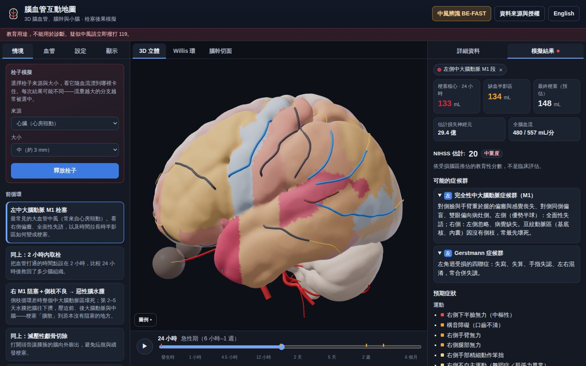
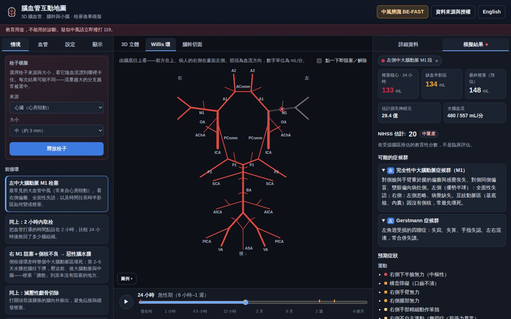
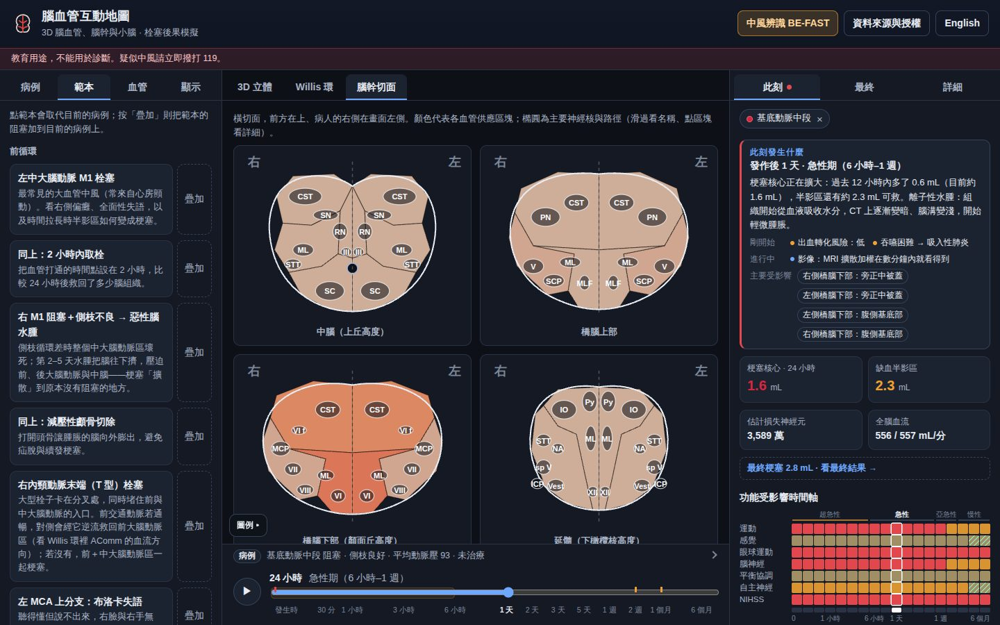

# 腦血管互動地圖 · Brain Vessel Interactive Map

**繁體中文** · [English](README.en.md)

[](https://github.com/LZong-tw/brain-vessel-map/actions/workflows/ci.yml)
[](https://github.com/LZong-tw/brain-vessel-map/actions/workflows/deploy.yml)
[](LICENSE)
[](public/data/LICENSE.txt)

在真實的 MNI 標準腦上看大腦、小腦與腦幹的動脈，塞住一條或多條血管（或放出一顆栓子），看
**幾分鐘到幾個月內**會怎麼影響「其他」腦區：缺血半影區變成梗塞、腦水腫與腫脹擠壓、腦疝脫、水腦、遠端退化……
以及每個時間點**哪些腦區、哪些功能**正在受損、還救得回來、或已經恢復，病程結束時又留下什麼。

**線上版：** <https://lzong-tw.github.io/brain-vessel-map/> （需先啟用 GitHub Pages，見下方〈部署〉）



> ⚠️ **教育用途，不能用於診斷。** 模型用的是「標準腦」和簡化的規則，不是任何一個人的腦。
> 懷疑中風請立刻撥 **119**（臉歪、手垂、說話不清楚——記下發作時間）。
>
> **Educational only — not a diagnostic tool.** Suspected stroke: call emergency services now.

---

## 怎麼用

1. **選一個起點**：左側「範本」載入教學病例（例如左 M1 栓塞、閉鎖症候群）；或到「血管」按任一條血管的「＋ 阻塞」。範本旁的「疊加」和血管的「＋ 阻塞」都會**加到**目前的病例上，所以可以組合多條血管（例如基底動脈中段 + 右 PICA）。
2. **調整病例**：左側「病例」有三張卡片——發病前條件（側枝循環、血壓、Willis 環變異）、阻塞事件（每條血管的程度與時程，例如先 TIA、三天後才完全阻塞）、治療（再通時間、方式與結果、減壓手術）。收合時每張卡片仍顯示一行摘要；時間軸上方也有整個病例的一行摘要。
3. **拖動時間軸**：從發生時到 6 個月。右側「此刻」顯示那個時間點的組織狀態、症狀、NIHSS 與事件；「最終」顯示病程結束時的結果（有設治療時，會和「同樣阻塞但沒有再通」對照）；「詳細」顯示點選的血管或腦區。「此刻」只在模型仍提供再通治療時（阻塞開始後一天內、尚未再通）說半影區「可救」，之後改說「仍可能壞死」；引用的量是現在的血流仍會殺死的那部分半影區，其餘即使血管不通也會靠側枝存活，另外說明；再通只讓部分區域恢復血流時（eTICI 低於 3、無再流、遠端栓塞），會說血流沒有回來的地方組織仍在壞死（或之後仍壞死了），而不說半影區停止惡化；小梗塞（例如腦幹）擴大達自身的十分之一（或 0.5 mL）就算正在擴大。
4. **分享**：整個病例都存在網址 `#` 後面，複製網址即可。

## 功能

| | |
|---|---|
| **真實解剖幾何** | 大腦半球、小腦、腦幹、視丘、基底核、內囊、胼胝體、齒狀核、腦室——由 MNI ICBM152 2009c 模板產生的 3D 表面，不是手捏的形狀。 |
| **180 段動脈** | 主動脈弓 → 頸動脈／椎動脈 → Willis 環 → 皮質分支、豆紋動脈、脈絡叢動脈、腦幹穿通支、PICA／AICA／SCA，其中 38 段是軟腦膜／顱外側枝；主幹位置校正到多中心 MRA 統計圖譜。125 個功能腦區、268 個「腦區 × 供應區」單位。 |
| **血流模擬** | 以 Poiseuille 阻力網路解每條血管的流量與方向：Willis 環逆流代償、鎖骨下動脈竊血、自動調節、低血壓時的分水嶺缺血，以及 21 種解剖變異（胚胎型 PCA、缺 AComm／PComm、永存三叉動脈、Percheron 動脈含或不含中腦與視丘前部……；預設的完整 Willis 環在成人只佔少數）。腦幹另有圖上沒畫出的軟腦膜側枝，其導通度隨血壓改變；鎖骨下動脈也有沒畫出的胸壁與頸部側枝。 |
| **病例 → 此刻 → 最終** | 左側「病例」集中一個病例的所有設定，「範本」可載入或疊加；右側「此刻」看顯示時間當下，「最終」看病程結束時：最終梗塞、3／6 個月的 NIHSS、留下的缺損與代償程度、晚期併發症。 |
| **時間軸** | 發生時 → 15、30 分 → 1、2、3、4.5、6、12 小時 → 1、2、3、5 天 → 1、2 週 → 1、3、6 個月。「此刻」與「詳細」都跟著時間軸變：組織狀態、還剩多久會失去半影區、哪些功能受損／瀕危／已恢復，以及整段病程的「功能受影響時間軸」熱圖（點任一格可看那個時間點的症狀、來源腦區與變化）。 |
| **分段病程** | 每條血管可設定開始與自行再通的時間，也可「之後變成完全阻塞」：模擬短暫性腦缺血（TIA）、狹窄後才完全阻塞（例如前驅 TIA → 數天後基底動脈閉塞），以及在任一時間點治療。 |
| **再通細節** | 治療方式（取栓／靜脈溶栓／橋接）、再灌流程度（eTICI 0–3）、再阻塞、取栓時碎片栓到遠端分支或新區域（同側 ACA）、無再流（證據有限）。模擬的是你選的結果；旁邊附上依阻塞位置整理的已發表數據（再通率、有症狀出血——中型／遠端血管與大核心取栓各有自己的數字、tenecteplase、超過 4.5 小時經影像篩選的溶栓、再阻塞、遠端與新區域栓塞、無再流），每個數字都有出處，並依部位提醒溶栓／取栓時間窗（選的時間是血流恢復的時間，比溶栓用藥晚 1–3 小時，所以要到藥物多半是在 4.5 小時後才開始時——約血流在 6.5 小時後恢復——才說單用溶栓太晚；基底動脈溶栓超過 4.5 小時只有專家共識、沒有試驗驗證的取栓部位、中型血管取栓的陰性試驗）。病程中的「治療時間窗」也依阻塞部位說明：前循環大血管（含大核心試驗）、基底動脈（試驗死亡率）、單純頸部 ICA、V4、中型／遠端血管與腔隙性中風。「已救回」只算「不治療會死、治療後活下來」的組織，包括不治療時腫脹造成疝脫而梗塞的區域。 |
| **恢復** | 早期的缺損比梗塞大（水腫與遠端功能抑制讓活著的組織暫時停擺），之後依備援路徑部分代償：單側病灶、有雙側支配或平行路徑的功能代償較多；腦神經核這類「最終共同通路」沒有備援；橋腦腹側或中腦大腦腳兩側大部分受損時主路徑與備援一起中斷，恢復很有限（會說出是哪一處）；再通後兩側只留下小梗塞時不算這種瓶頸。失語與忽略能被代償多少，要看同一半球的中大腦動脈皮質還剩多少：幾乎整個語言皮質都梗塞時，3 個月後仍是嚴重或全面性失語；理解力還要看韋尼克區剩下多少：韋尼克區梗塞超過約五分之三時，3 個月與 6 個月後仍是中重度的韋尼克型失語。腦幹由緻密的神經徑與神經核組成，缺損依梗塞或仍未恢復的比例逐漸減輕，不會在門檻上一起出現或消失。有些部位還看左右側：右側視丘旁正中梗塞的認知障礙多半會恢復，左側或雙側的常持續。只是示意的群體平均，不是預後。 |
| **水腫與腫脹** | 細胞毒性水腫（DWI，幾分鐘內）→ 離子性水腫（CT 低密度，數小時）→ 血管性水腫（第 3–5 天最腫）→ 消退 → 萎縮（數月後）；3D 腦會依各區腫脹量變形（可放大 1×／3×／5× 以便看清楚），另有「水腫／影像」著色模式（ADC 恢復正常後 DWI 仍亮數週，T2／FLAIR 因膠質疤痕一直是亮的）；中線偏移、腦室受壓或擴大隨時間計算，意識程度跟著中線偏移變化（兩側半球都腫脹時，跟著兩側合計的腫脹）。 |
| **連鎖反應（對其他部位的影響）** | 惡性 MCA 水腫 → 半球本身的腫脹把中線推到昏迷範圍時（不論另一側如何）大腦鐮下疝脫（壓 ACA）與鉤迴疝脫（壓中腦、PCA；被疝脫壓到梗塞的大腦腳，會留下穿過它的動眼神經纖維的麻痺）；兩側腫得差不多時，是腦向下的中央型天幕切跡疝脫，單獨就會疝脫的那一側保留它本身腫脹造成的續發梗塞（只有兩側合計的腫脹才達昏迷範圍時則不加），未減壓時標示「很可能死亡」；占位性小腦梗塞分級（20 mL 起要觀察、38 mL 起可能惡性腫脹）→ 腦幹受壓與阻塞性水腦，意識隨腫脹變化，未手術而昏迷時標示「危及生命」；出血轉化風險；交叉性小腦失聯（CCD）；錐體徑 Wallerian 退化；可能的下橄欖核肥大退化與軟顎顫抖；視丘萎縮；兩側腦幹被蓋大範圍梗塞又昏迷時的中樞性高熱風險；延髓外側梗塞（單側也可能）前 10 天的呼吸衰竭風險；只有內耳梗塞時當成中風警訊、而不是 TIA；吸入性肺炎（在病例列出吞嚥困難或意識變差的期間出現，標題依當時列出的是哪一項；梗塞很大時，在兩者列出之前先提醒做吞嚥篩檢）、中風後的心臟併發症（任何梗塞都可能；從 NIHSS 達 16 分或列出木僵、昏迷時起註明是嚴重中風——依臨床嚴重度，不是梗塞體積——再通讓缺損消失後改說發作時很嚴重，島葉受累時另外說明）、深部靜脈血栓（第 2 到第 30 天、病人無法自己活動的期間：腿抬不起來、木僵或昏迷、意識障礙、無動性緘默）；疊加多次阻塞時，每個留下梗塞的病灶都從自己的發作時間起算這些警示與中樞性高熱的風險、早發與晚發癲癇（附晚發性發作的比率）、可能出現的中樞性疼痛與痙攣（和症狀同時出現）、腦幹梗塞後可能出現的 REM 睡眠行為障礙、憂鬱…… |
| **臨床輸出** | 預期症狀（依系統分組、左右側）、具名症候群（Wallenberg、Weber／Benedikt、Foville、閉鎖症候群（典型、不完全，以及昏迷時的基底動脈昏迷）、橋腦前內側症候群、Percheron（含或不含中腦）、視丘四個供應區、Gerstmann、腔隙性、內囊警訊症候群、桶中人、雙側延髓內側梗塞、前脊髓動脈症候群……共 55 條規則）、NIHSS 估計（缺血在椎基底動脈系統、又有症狀時提醒後循環常被低估——只是梗塞延伸到枕葉的中大腦動脈或頸動脈中風不算；分數為 0 但有量表不計的症狀時會註明）。單一穿通支（腔隙）阻塞可以選落點：同一條小分支落在內囊後肢、放射冠、內囊膝部或橋腦，分別呈現純運動性、運動失調性偏癱、構音障礙—笨拙手或內囊膝部的意識混亂與失憶。腔隙性的標籤是臨床症候群：同樣的表現幾分鐘內消失、沒有留下梗塞時就是腔隙性 TIA；同一支小動脈一天內有兩次這樣的 TIA，才算內囊警訊症候群。 |
| **非運動功能** | 依受損部位出現、跟著時間軸變化：睡眠（中樞性睡眠呼吸中止、長期嗜睡）、情感表達（病理性哭笑）、體溫調節與出汗（同側無汗、對側半身多汗、癱瘓側肢體偏冷）、味覺喪失、尿滯留；功能熱圖各有一列。晚期的後果各有自己的開始時間（痙攣與中樞性疼痛約 2 週、病理性哭笑約 3 週、肢體發冷約 1 個月、中腦梗塞後的霍姆斯顫抖約 2 個月）；中樞性疼痛與病理性哭笑標成「可能出現」，不算進 6 個月時的缺損數；痙攣只有在早期無力嚴重或半身感覺減退時才較嚴重。「最終」頁另列出中風後常見、但與病灶部位關聯有限的問題（憂鬱、焦慮、冷漠、病理性哭笑、疲勞、失眠、睡眠呼吸中止、失智）、最常見的併發症（跌倒、肩膀痛、尿失禁、感染、再次中風），以及少見（約 1%）的中風後不自主運動，附族群盛行率與出處——模型算不出個人風險，也不計入症狀或 NIHSS。 |
| **三種視圖** | 3D（可切面、調透明度、只看單側）、Willis 環示意圖（即時流量與方向，可直接點擊阻塞）、腦幹四個層面的血管分區切面。 |
| **栓子模擬** | 選來源（心臟、左右頸動脈斑塊、左右椎動脈）與大小，依各分支流量隨機漂流，卡在比它窄的血管——大栓子多卡在 ICA 末端或 M1，小栓子進到皮質分支。 |
| **35 個教學範本** | 左 M1、取栓對照、惡性水腫與減壓、T 型栓塞、Broca／Wernicke、ACA、AChA、紋狀體內囊梗塞、內囊、放射冠與橋腦腔隙、內囊警訊症候群、視丘、Percheron（含或不含中腦）、PCA、基底動脈頂端、閉鎖症候群、Wallenberg、PICA（注意腫脹）、PICA＋SCA 腫脹與水腦、AICA、SCA → 可能的軟顎顫抖、Dejerine、頸動脈狹窄、分水嶺、竊血、一過性黑矇、TIA、進展性基底動脈血栓…… |
| **其他** | 繁中／英文（介面與所有解剖、症狀、事件文字）、可分享的網址、手機版面、BE-FAST 衛教。 |

| Willis 環與「最終」結果 | 腦幹切面與「此刻」 |
|---|---|
|  |  |

## 這個模型怎麼算的

1. **幾何**：`tools/build_assets.py` 從 TemplateFlow 下載 MNI152NLin2009cAsym 的分割與機率圖，用 marching cubes 產生網格；每個表面點被標上「功能腦區 × 動脈供應區」（床，bed），供應區來自 Liu 等人的動脈分區圖譜，重疊處即分水嶺。
2. **血流**：每條血管是一個 Poiseuille 阻力；每個床由一條或多條供應動脈分攤；側枝依等級（好／中／差）有不同導通度；小動脈在灌流壓下降時擴張（自動調節，上限 1.8 倍）。腦幹另有圖上沒畫出的軟腦膜側枝，血壓高於正常時會隨之收縮；鎖骨下動脈另有圖上沒畫出的胸壁與頸部側枝，近端阻塞時和倒流的椎動脈一起供應手臂。只有部分人才有的血管（永存三叉動脈）只在選了該變異時存在，被變異移除的血管不會畫出。大腦半球表面的軟腦膜動脈（A2、M2、P2 及其皮質分支）與它們之間的軟腦膜側枝，長度與基礎流量取左右兩側的平均，讓同一條動脈在兩側阻塞時的血流一樣（見「限制」）。解線性方程得到各點壓力與流量。
3. **病程分段**：阻塞可以在不同時間開始、自行再通、之後惡化，治療也可能再阻塞或把碎片沖到遠端；每一段「阻塞不變」的時間各解一次血流，組織沿著這條血流歷史演變。時間以第一個事件為 0；連鎖反應與恢復則從造成大部分梗塞的那次阻塞起算（每個病灶的腫脹依它自己的時鐘，見下；沒有梗塞時，從最近一次造成缺血的阻塞起算，之前的每次發作各自當作一次發作來說明），而各腦區的晚期症狀、代償與昏迷改列，則從該腦區本身開始缺血時起算；疝脫造成的續發梗塞，從疝脫的那個腫脹病灶（它自己那一側的半球）開始時起算：右側 M1 惡性梗塞的疝脫梗塞，不會在一個月後的左側 M1 阻塞成為主要事件時重新起算，它造成的腿部無力也保有已經得到的代償。每個時間點顯示的是當時的病情：之後才開始的阻塞當時還不知道，在它開始之前什麼都不改變——不改變腫脹、意識程度、事件，也不改變「此刻」對病程的預估（之後會完全阻塞的狹窄，在那之前就是持續的狹窄）；「最終」頁與通往它的最終梗塞那一行，顯示的是整個排程的結果。後來的阻塞開始之後，每個病灶仍依它自己的時鐘腫脹、疝脫，並有它自己的水腫事件（惡性水腫或占位效應、疝脫與它造成的梗塞、交叉性小腦功能抑制、小腦腫脹），所以較早的梗塞不會在較大的阻塞開始時失去腫脹或疝脫梗塞，疝脫已經壓壞的組織也不會因為後來的阻塞本來也會讓它梗塞而又活回來；已經開始的腫脹病程（水腫、疝脫、疝脫後很可能死亡的提示）不會被後來的阻塞拿掉、改標題或提早在它開始之前結束，已經開始的治療與再通事件（治療時間窗、血管再通與之後的再阻塞或遠端栓塞、血管自行再通、Willis 環側枝代償、紋狀體內囊梗塞的皮質徵象）也一樣：因為後來的病灶而改變的說法（例如中度占位效應變成惡性病程），從後來那個病灶的第一天起才這樣說。每個半球（以及小腦）的腫脹依它自己的病灶分類（病灶在一天之內開始的那些床；小腦另外算進腫脹期和它重疊的每個小腦梗塞，不論較早或較晚，因為後顱窩的病程只依梗塞大小決定：病程從當時已開始的梗塞合計達到該等級時起算，所以相隔幾天的兩個小腦梗塞不論誰先開始，腫脹都一樣，較晚的那個開始前已經說過的病程照原樣保留），每個病灶的腫脹依和它同時在腫的病灶大小而定，後來的病灶要等它自己開始腫脹才算進來（所以較早的腫脹不會在後來的阻塞開始時突然變大）；兩側半球只有在兩側病灶相差一天之內開始時，才合起來和單側惡性梗塞的大小標準比較（腫脹在時間上重疊時仍會合計）；其他事件（超急性期機轉、影像、出血轉化、癲癇、晚期退化）依造成大部分梗塞的那次阻塞的時鐘進行，這是疊加多次中風時的簡化。文字中的「發病後」從這個主要發作起算；腫脹的文字從它自己的病灶起算，不是主要發作時會註明（右側 M1 阻塞後約 279 小時緩解的右半球疝脫就這樣說明，即使一個月後的左側 M1 成為主要事件也一樣）。沒有留下梗塞的腦缺血，在缺損還在時，當作還分不出是不是 TIA 的急性中風來說明：列出它那些阻塞的治療時間窗，不等著看它會不會消失，抗血小板藥物要等影像排除出血後才給；從症狀清單不再有缺損時起，才說 TIA 的部分（「症狀消失不代表沒事」與抗血小板藥物的建議，打過血栓溶解劑時要等 24 小時的追蹤影像）（Powers 2019；Easton 2009）。上段頸髓（前脊髓動脈的供應區）缺血時有它自己的病程（脊髓梗塞、脊椎 MRI、之後的恢復），腦也缺血時與腦的病程並列；只有手臂或臉部缺血時，不說腦的病程。
4. **組織命運**：相對血流 < 30% 為核心梗塞，30–55% 為缺血半影區，55–85% 為輕度低灌流。組織死得多快，取決於血流剩多少、缺血多久。終末動脈完全沒有血流的地方（深部穿通支供應的灰質，例如紋狀體與視丘）約 6 分鐘後開始壞死、十幾分鐘內大部分死亡。同一群穿通支供應的白質（內囊與放射冠）撐得比較久：約 2.5 小時內不會壞死，之後約 4 小時死一半、6 小時死大部分，依取栓時不同再灌流時間下內囊被保住的比例校正。腔隙（一束穿通支中的一條分支）依它所在組織的時程壞死，一條分支後面和整束穿通支後面一樣，占的範圍也不超過那束穿通支在該構造供應的部分：內囊的一條分支阻塞 1 小時，留下的內囊梗塞不會比整群豆紋動脈阻塞 1 小時多，也就是沒有，功能也和整群阻塞時的內囊一樣，在之後幾小時內恢復；所以 M1 阻塞在 1–2 小時內打通，紋狀體仍會梗塞，手臂通常保得住，6 小時才打通就很少保得住。腔隙在最終腦區清單與腦區細節裡以它自己的體積與所占比例顯示（約 0.8 mL：放射冠的 6%、內囊後肢的 38%），和上方的最終梗塞相符；它讓這個構造失去的功能（大部分）則顯示為該腦區的失能，腦區細節也會說明為什麼這麼小卻影響這麼大。落點沿用構造本身缺損的腔隙（尾狀核頭、橋腦下部、延髓外側），讓構造失去的功能也不超過整束穿通支阻塞時：Heubner 動脈的一條分支不再留下整條 Heubner 動脈都不會留下的持續構音障礙，橋腦下旁正中的一條分支造成的偏癱也不比整群分支重（有自己症候群的落點，例如純運動性或運動失調性偏癱的腔隙，仍失去所在纖維束大部分的功能）。側枝還送得到血的組織（皮質、白質、小腦）前 20 分鐘不會壞死，之後完全沒有血流時約 2.5 小時死一半，剛好低於核心門檻時約 6 小時死一半，半影區更慢（血流越低越快死；從未再通時最多 85% 能靠側枝存活，存活的部分在約 12 小時內逐漸恢復功能）。缺血開始兩天後，除非還在壞死，組織就不再算半影區：到那時半影區不是已經壞死，就是會存活（用標示缺氧但仍存活組織的 PET，這種組織在前兩天越來越少、越來越小：Read 2000；Markus 2004），所以從第 2 天起顯示的半影區大約就是病程還會失去的組織，其餘是會存活、仍暫時不運作的組織，照以前一樣逐漸恢復功能（「此刻」與腦區的詳細資料都這樣標示，和再通後救回的組織一樣，不當作已壞死的組織）。側枝差的 M1 阻塞，梗塞在 1 小時約 60 mL，前幾個小時每小時增加 35–55 mL，約 12 小時填滿整個供應區（大血管阻塞實測最快的速度約每小時 74 mL）；側枝中等時每小時約 20–30 mL。不治療時低於核心門檻的組織終究都會死，所以最終梗塞和以前一樣，只是時間進程變慢，側枝差時及早再通也救得回組織。再通救回的組織要幾小時到幾天才恢復功能，不是立刻恢復：缺血 1 小時後約四分之一立刻恢復，缺血 1 小時約 2 小時、缺血 6 小時約一天內恢復一半，其餘在數週內恢復（幾分鐘的 TIA 立刻恢復）。視網膜在完全阻塞約 12 分鐘後才開始壞死（人類估計值；猴子實驗長得多），所以幾分鐘的一過性黑矇不留梗塞。腦幹的半影區死得較慢、未治療時存活較少，這是為了符合基底動脈取栓試驗（ATTENTION、BAOCHE）而校正的。單一穿通支（腔隙）阻塞不改變模型看得到的血流，它的組織從阻塞當下就停止運作，在組織開始壞死之前再通（幾分鐘內；在內囊與放射冠約 2.5 小時內）就不留下梗塞（內囊 TIA）。穿通動脈是終末動脈，不論只阻塞一條分支或整束，後面的白質都沒有側枝血流能到達：「此刻」說它還活著是因為白質在完全沒有血流時要幾個小時才會壞死，而不是靠側枝撐著。最終梗塞在最後一次血管變化後 6 個月評估。
5. **治療**：在選定時間打通「當時存在的完全阻塞」。再灌流程度（eTICI）決定供血區有多少比例走「再通後」的路線，其餘照未治療的路線；無再流、再阻塞與遠端栓塞各自修改這條路線。「已救回」＝未治療會梗塞、治療後存活的組織，包括不治療時腫脹造成疝脫、壓迫而梗塞的區域（即不治療與治療的最終梗塞之差）。治療打通血管後，「治療時間窗」就結束（血管自行再通而留下梗塞時也一樣），打通的血管在發作第一天內又塞住（再阻塞）時，時間窗在當天剩下的時間再度出現，仍從發作時起算；eTICI 0 的嘗試在病例摘要寫成「嘗試、未再通」，找不到可打通阻塞的治療（模型不會打通的腔隙性阻塞用靜脈血栓溶解，或當時沒有完全阻塞）則寫成在那時給予，沒有 eTICI 分級、沒有治療與不治療的比較，也沒有「已救回」。eTICI 是依最後血管攝影上整個下游區域恢復灌流的比例分級（3 = 100%、2c = 90–99%、2b67 = 67–89%、2b50 = 50–66%：Liebeskind 2019），所以被血栓碎片塞住的下游分支會依它供應的正常血流比例降低顯示的分級（M1 取栓時下分支栓塞，選的 3 會變成 2b50）：選的分級是其餘區域的結果；栓到新區域則另外報告，不改變所選分級。血管自行再通而留下梗塞時，有自己的事件與「此刻」說明，並列出和血管一直阻塞相比救回了多少（一項 53 個研究的統合分析中約四分之一的阻塞會自行再通：Rha 與 Saver 2007）；在任何組織壞死之前就再通的，當作 TIA。自行再通和治療打通一樣判斷：腫脹造成疝脫時壓迫到哪些仍活著的組織，依血管一直阻塞時的病程而定，所以結果和同一時間完全取栓相同，不會比血管一直阻塞更大。較晚的阻塞，其治療時間窗引用的核心是決定治療時它自己的病灶壞死的量，不是較早的梗塞；較早的梗塞在 3 個月內（且至少早一天開始；模型的選擇）時，說明靜脈血栓溶解不是標準治療：指引建議不要使用，這是主要依據專家共識的相對禁忌，一個登錄研究中只有前一次中風在 14 天內時症狀性腦出血較多（Shah 2020；Scala 2026）。「血管再通」事件會列出有無治療時 3 個月的 NIHSS，並在避免了缺損（至少 2 分）、避免了常會致命的病程（疝脫、腦幹受壓、基底動脈沒打通又昏迷），或保住至少 50 mL 腦組織時標示為有益：避免閉鎖症候群只救回幾 mL 的橋腦；反過來，不治療時致命的病程，模型給的是假如病人存活時的 NIHSS，NIHSS 對右半球梗塞的計分也比同樣大小的左半球低，最終梗塞體積本身就預測日後的功能。兩邊 NIHSS 一樣時不會寫成「約 X 分（不治療約 X 分）」，而會說明 NIHSS 看不出、但治療保住了多少組織；不治療時致命的那一欄在事件與「最終」頁都註明「假如病人存活」。再通只救回極少量的組織（不到 0.5 mL，也不到不治療時梗塞的十分之一）時，這點組織剛好在嚴重度等級交界處造成的 NIHSS 差距不算在再通身上（見限制）：事件會說明，也不因此標示為有益，不完全閉鎖的事件也不說再通救回部分橋腦；沒有這次再通、四肢也會在同一時間（一天之內）恢復部分動作時，也不這樣說，例如側枝良好的中段基底動脈阻塞在 2 天時再通，不論有沒有再通，四肢都在第 9 天恢復部分動作；0.05 到 0.5 mL 的量寫到小數一位，不寫成「約 0 mL」；算不算極少量，看再通本身救回多少，不扣掉它送出的血栓碎片在別處造成的梗塞。腦幹的小梗塞不算極少量：下段基底動脈阻塞、側枝差、6 小時打通時救回 1.5 mL 中的 0.4 mL，仍算有益。
6. **水腫**：依各床的核心、半影區與再灌流狀態，分別累積細胞毒性、離子性、血管性水腫與後期萎縮；腫脹體積換算成中線偏移（減壓手術後大部分往顱外擴張），意識程度依中線偏移的大約範圍下降（Ropper：約 4 mm 嗜睡、6 mm 木僵、8 mm 昏迷）。兩側半球都腫脹時，會把腦往下擠而不是推向對側，中線移動較少：模型這時把兩側的腫脹加在一起，視同單側半球的腫脹，來決定意識程度。一側半球會不會疝脫、何時疝脫，依它本身的腫脹（單獨腫脹時會造成的中線偏移）：從第 3 天起、在這個腫脹仍達昏迷範圍時疝脫，所以另一側較小的腫脹（會往回推）不會讓它的疝脫與續發梗塞消失；另一側的腫脹小到沒有自己的水腫事件時，兩側合計、從這一側推過去的腫脹仍達昏迷範圍，也讓它疝脫，和昏迷一致。疝脫開始時，若中線被它推過去 4 mm 以上，就向它自己那一側疝脫（鉤迴與大腦鐮下疝脫）；否則兩側一起被往下壓（中央型疝脫：沒有大腦鐮下疝脫、沒有單側的動眼神經麻痺），單獨就會疝脫的那一側保留它本身腫脹造成的續發梗塞——後大腦動脈區壓在天幕邊緣，和單側或兩側占位造成天幕切跡疝脫後的情形一樣（Keane 1980），以及前大腦動脈區壓在大腦鐮上（這是模型的選擇：兩側一起腫脹時扣帶迴不會滑到大腦鐮下方）；兩側都不會單獨疝脫、只有合計的腫脹才達昏迷範圍時，中央型疝脫不加上續發梗塞（無法判斷是哪一側、多大；這是模型的選擇）。兩側都有至少三分之二的中大腦動脈區失去功能時，不論腫脹多少，前兩週至少列為嗜睡。以梗塞大小來看，兩側合計只在兩側都有會腫脹的中大腦動脈區梗塞時，才走惡性水腫與疝脫的病程（惡性梗塞的證據來自中大腦動脈區梗塞）：兩側前或後大腦動脈區的梗塞（或一側中大腦動脈、另一側前大腦動脈）是兩側各自的中度占位效應，腫脹仍合計來決定意識；只有和另一側合計才達標準的那一側，文字會說明是兩側合計，不會在較小的單側體積旁寫「> 145 mL 為高風險」。不論大小，腫脹達昏迷範圍（8 mm，單側或兩側合計）就是惡性腦水腫，從第 3 天起、仍在這個範圍時疝脫：兩側頸動脈區（中與前大腦動脈區）都梗塞、各自都未達惡性的大小時，兩側一起腫到昏迷並向下疝脫，附致命風險，而不是昏迷一週後醒來；單側約 245 mL、本身的中線偏移達 9 mm 的半球也一樣。模型裡腫脹造成的昏迷一定伴隨這個病程；木僵（6–8 mm）則不會。兩側大腦半球最後都有三分之二以上梗塞（包括疝脫造成的續發梗塞），或兩側的中大腦動脈區都有三分之二以上梗塞（皮質和視丘之間很大一部分的白質連結經過這裡），不論有沒有疝脫，存活者在較晚那次病灶的兩週後列為意識障礙（植物人或最小意識狀態，NIHSS 1a 計 3 分），不會醒成清醒的病人（Adams 2000；Multi-Society Task Force 1994），「最終」頁也換成兩側的說明，不用單側的存活數字。
7. **連鎖反應**：用文獻中的簡化門檻（例如 14 小時內梗塞 > 145 mL → 惡性水腫；小腦梗塞 ≥ 20 mL 要觀察腫脹、≥ 38 mL 惡性腫脹可能），把後果投射到**沒有被阻塞**的腦區。只有在 Willis 環把血送進阻塞或狹窄之後的區域時，才說它的側枝代償啟動：靜止時供應某個交會點的動脈全都阻塞、狹窄，或來自這樣的交會點，而前交通、後交通動脈或眼動脈流進這個交會點的血流增加超過每分鐘 5 mL（模型的選擇）。所以它能接上阻塞的頸動脈、A1、P1 或基底動脈，以及內頸動脈 T 型血栓之後的前大腦動脈，但到不了在 Willis 環之後阻塞的 MCA、A2 或 P2；事件只列出真正有送血的通道（兩條交通動脈都缺如時只有眼動脈），仍有梗塞時會說它補不足，並列出那個區域的梗塞量。只有那個區域在動脈阻塞時也維持運作，才說它足以避免梗塞（綠色）：內頸動脈 T 型或基底動脈只塞住幾分鐘、因為發作短暫而沒有梗塞時，會說它不足以讓那個區域在阻塞時維持運作（症狀就來自那裡），直到動脈再通。（單看交通動脈血流反轉說明不了什麼：在對稱的網路裡前交通動脈靜止時的流向是任意的，所以它在一側的 M1、M2、A2 阻塞時「反轉」，另一側從不反轉。）紋狀體內囊梗塞的皮質徵象（Donnan 1991）：阻塞從未到達皮質時（只有豆紋動脈）從發作起出現；M1 阻塞在皮質壞死前再通時，從再通起出現，並說明皮質正逐漸恢復功能；文字只列出真正壞死的深部構造（不列早期再通保住的內囊）。
8. **症狀、症候群與恢復**：每個腦區列出受損時的症狀（同側／對側），聚合後再用規則比對具名症候群；以徵象命名的症候群（忽略、Wallenberg、純感覺性腔隙症候群、閉鎖症候群、視網膜缺血、內耳中風……）只在那些徵象同時出現在症狀清單時才列出（失語或意識下降讓單眼視力喪失無法檢查時，不列視網膜缺血的標籤：那個徵象另外標出並說明原因，能檢查時標籤再出現），以血管分布命名的（供應區、分水嶺）在組織仍受損時保留，這一側已沒有症狀（列出的或目前無法檢查的）時標為「臨床無症狀」。前大腦動脈症候群指內側額葉或扣帶迴連同前大腦動脈區另一個腦區的梗塞，側枝保住旁中央小葉（也就保住了腿）時也一樣。分水嶺的標籤和它的說明一致，要這一側有血流動力學的背景：平均動脈壓低於 70 mmHg，或頸動脈或 M1 段有嚴重（≥ 70%）狹窄或阻塞（Bogousslavsky 與 Regli 1986；Wong 2002）；單一遠端分支被栓子塞住是分支供應區梗塞，即使它的供應區落在邊界區的床上也一樣。這些門檻是模型的選擇。中大腦動脈上、下分支的標籤採用症狀本身的門檻（25%），所以和它描述的缺損一起存在；左側時，旁邊列出的失語屬於另一個分支（下分支標籤旁的表達性失語、上分支標籤旁的接受性或傳導性失語），或是全面性、混合型經皮質失語時，兩個標籤都不顯示；下分支的標籤也要旁邊有它描述的徵象之一（列出的或目前無法檢查的）才顯示：左側為接受性或傳導性失語，右側為左側忽略或視覺空間障礙，兩側都可以是視野缺損——右側 M1 在 4.5 小時打通、側枝良好時，忽略到 3 個月已被代償，保留紋狀體內囊梗塞的標籤，不再標下分支症候群（徵象都消失後，這個標籤也不再標成臨床無症狀而保留）。完全性中大腦動脈症候群的標籤描述整個供應區的表現，不指定血管節段（最常見的是 M1 阻塞，也可能是側枝補不上的內頸動脈阻塞），而且只在它描述的無力或感覺喪失（臉、手臂或腿的無力，或臉與手臂、整個半身的感覺喪失，列出的或目前無法檢查的）旁邊，或內囊梗塞時才顯示：M1 取栓時血栓碎片塞住下分支，留下紋狀體與那條分支的皮質（含腦島）梗塞，占這個供應區四個皮質區，旁邊是韋尼克失語與偏盲、完全沒有無力，這時以下分支症候群的標籤命名；血流動力學背景下的邊界區表現，改以分水嶺標籤命名：整個半球的受損有 35% 以上落在邊界區，或受損遍及中大腦動脈區（四個以上的皮質區）而周圍供應區的核心沒有受損那麼多（前、後大腦動脈區本身受損的比例不到邊界區的一半，就像分水嶺梗塞不波及交會的各供應區核心）時，中大腦動脈區與它的邊界區的受損有 35% 以上落在邊界區。第二種算法是因為 Willis 環左右不對稱：頸動脈嚴重狹窄加上低血壓時，右側前大腦動脈區本身缺血得較多（16 mL，左側 5 mL），只看整個半球的比例時，同樣的中大腦動脈區表現在左側稱為分水嶺，右側卻稱為完全性中大腦動脈症候群。前脊髓動脈症候群的標籤標示上段頸髓的梗塞。各腦區的語言成分依流暢度、理解與複誦合成同一時間只有一種的失語類型（全面性、布洛卡、韋尼克、傳導性、經皮質、混合型經皮質），成分被代償後類型也會跟著改變，但只往較輕的類型變、說話流暢的失語不會再變回不流暢（哥本哈根失語研究）：變輕的全面性失語改列布洛卡型，理解比說話受損更重時改列韋尼克型；再通救回的組織逐漸恢復功能時，由留下來的部分決定類型（言語失用或壞死組織造成的缺損讓它維持不流暢），第 2–5 天短暫的水腫會讓各成分加重，但不會讓它再變回全面性失語。只有少數病人會出現的現象（例如盲視野中的釋放性幻視）名稱標成「可能出現：」，說明寫「可能」，不是預測；看不見的那部分視野不會再列出色覺喪失；黃斑迴避（偏盲時保留的中心視力）是在描述偏盲，本身不是缺損，所以失去它（腫脹讓枕極也暫時停擺時）不算改善，「最終」頁把它寫在偏盲旁邊，不算進持續的缺損；病人昏睡、昏迷或處於意識障礙時，也不列出只有清醒、能配合的病人才表現得出來、說得出來或檢查得到的項目（行為、執行功能、記憶、主動性、情緒、步態、色覺、閱讀、書寫、計算、各種失認與失用、病覺缺失、指鼻測試與手部精細動作，以及眩暈、複視、疼痛這類只能由病人自己說出的症狀）。手臂無法對抗重力抬起的那一側（運動失調則也包括腿完全不能動的一側），也不列出肢體運動失調、手臂動作時的顫抖與手指精細動作（手部笨拙）：NIHSS 不計分癱瘓肢體的運動失調，不能動的手腳也表現不出這些症狀；同樣的道理，手臂無法對抗重力抬起的那隻手，也不列出異己手（手自己抓握、摸索，或左手和右手互相作對）與胼胝體斷聯造成的左手失用與失寫；胼胝體斷聯造成的這兩種左手症狀要和右手比較（左手和右手互相作對，右手做得到的指令動作與寫字左手做不到），所以右手臂無法對抗重力抬起時也不列出。步態與軀幹不穩要看病人走路、站立與坐直（Carmona 2016），兩腿都無法對抗重力抬起時也不列出：病人站不起來，軀幹兩側也無力、無法自己坐穩；只有一腿無力時仍可讓病人坐著檢查軀幹，所以仍會列出。認臉、認物、閱讀、看路、伸手拿看到的東西與視覺空間能力都要看得見才能檢查，病人看不見時（皮質盲，或兩側半邊視野都看不到、中心視力也沒保留）不列出，也不標 Balint 症候群。無動性緘默的病人雖然清醒，卻幾乎不動、不說話、不照指令做，需要病人動手、回答或自己說出來的項目（失用、異己手、伸手、認物、讀寫、記憶、失語的類型）都檢查不了，只列看得到的表現。病人聽不懂話時（中度以上的全面性、接受性或混合型經皮質失語），閱讀、書寫、計算、說出手指名稱、語文記憶、對自身缺損的覺察，以及眩暈、複視、味覺、位置感、疼痛這類只能由病人說出的症狀，都要透過語言才能檢查，和失語分不開，所以另外標出；兩手的失用症可以請病人模仿動作來檢查，不需要語言，仍會列出（De Renzi 1980）；但胼胝體斷聯造成的左手失用與失寫，要看左手做不出指令、寫不出字而右手可以（Watson 與 Heilman 1983），這要透過語言，所以也另外標出；左手和右手互相作對是看得到的，不必靠指令，仍會列出。量表在昏睡時仍要計分的言語（失語、口齒不清或聲音沙啞：第 9、10 項）與忽略（第 11 項）照樣列出，到昏迷時才不列（此時這些項目依完全沒有反應的病人計分）；意識障礙以不能說話的病人計分，也不列言語的項目。這些缺損並沒有消失：「此刻」（摘要與症狀清單）、功能熱圖（點狀格子與點開的格子）、腦區細節與「最終」頁（含缺損項數）會另外標成「目前無法檢查」並註明原因（意識下降、看不見、無動性緘默、聽不懂話、肢體癱瘓），不算改善或消失，能檢查時再列出，NIHSS 也不會因此降低。NIHSS 依量表本身的計分規則估計（輕微無力＝漂移 1 分；肢體運動失調依肢體數計分，同側輕度算一肢 1 分、中度以上算手和腳 2 分；聽不懂或癱瘓時不計運動失調；昏睡（stupor）與構音不能也會影響問答題（1b），昏睡的病人聽不懂問題（1b 計 2 分），兩個指令最多也只做得到一個（1c 至少 1 分）；嚴重失語或話很少（第 9 項 2 分）時，兩個問題最多答對一個（1b 至少 1 分）；腦幹病灶造成雙側感覺喪失計 2 分；完全不能說話的全面性失語（第 9 項 3 分）也不能遵從指令（1c 計 2 分），構音項以「無法說話」計 2 分（第 10 項）；意識障礙也照這樣不能說話、不能遵從指令的病人計分，這是床邊檢查看到的樣子——若發現病人能用眼球動作回答，那就是閉鎖症候群，應以清醒的病人計分，模型無法模擬這個發現；無動性緘默以清醒但不能說話（第 9 項 3 分、第 10 項 2 分）、不做任何指令（1c 計 2 分）、因失語以外的原因無法回答（1b 計 1 分）的病人計分）。兩側額葉眼動區都受損時，不會同時列出偏向左右兩邊，而是兩側自主水平注視都困難；上段頸髓造成的兩側缺損和延髓造成的同一側缺損，每一側只列一次；同一側較廣的缺損所包含的一部分，嚴重程度不超過它時，就以那個較廣的缺損列出，如同象限盲是偏盲的一部分（癱瘓的手臂不會另外列出較輕的肩膀無力；全部感覺都喪失的半側感覺喪失，包含這一側的痛溫覺、位置感與臉、手、腳的感覺喪失；整側臉的周邊型麻痺包含下半臉的無力），比整體更嚴重的那一部分則列在旁邊，表示那裡更嚴重（臉與手的感覺喪失比這一側其他地方更多）。早期另加水腫與遠端抑制造成的暫時失能（它會讓缺損延續、加重，但動脈再通後，不會讓血流恢復時已經消失的缺損再回來：及早救回的基底動脈阻塞不會在第 3 天變成閉鎖症候群），之後依該功能的備援程度逐步代償。沒有備援的功能，「此刻」要等缺損完全來自壞死組織時才說它不會再改善：梗塞周圍的水腫仍在加重它、腫脹的鄰近組織壓迫它的路徑，或組織還活著只是暫時不運作時都不說，剛改善的那一個時間點也不說。失語與（右半球的）忽略主要靠同一半球剩下的皮質重組，對側同源區接手得較差：同一半球的中大腦動脈皮質梗塞超過六成後，能被代償的比例逐漸下降，幾乎全部梗塞時只剩一成左右，所以整個中大腦動脈區梗塞的存活者 3 個月後仍是全面性失語或嚴重的布洛卡／韋尼克型失語、嚴重忽略；中大腦動脈分支（M2）的梗塞與及早再通的病人恢復照舊（大多數失語病人恢復得不錯，持續中重度缺損主要見於整個中大腦動脈區或大範圍顳頂葉受損：Wilson 2023）。理解力靠韋尼克區本身剩下的部分接手，與整個梗塞多大無關：韋尼克區梗塞超過一半後能被代償的比例下降，超過約五分之三時，3 個月與 6 個月後仍是中重度的韋尼克型失語（NIHSS 第 9 項 2 分、兩個問題都答不對），一半以下則恢復到輕度（Naeser 1987；持續的韋尼克型失語通常還涉及緣上迴與角迴：Kertesz 1993）；這種梗塞後好轉的全面性失語，會變成嚴重的韋尼克型失語。眼球偏向不受病灶大小影響：它靠對側額葉眼動區在數天內接手（Steiner & Melamed 1984）。腦幹由緻密的神經徑與神經核組成，小梗塞也會切斷相應比例的纖維：缺損在症狀門檻以下仍依受損比例分級，降到 15% 時才消失（比這更小的部分在模型裡代表相鄰動脈供應的邊緣，例如 Wallenberg 時的延髓內側、Percheron 梗塞時的中腦），所以恢復中的腦幹徵象逐漸減輕、不會一起消失，梗塞略低於門檻時也會留下相應的缺損；兩側一起才有的徵象（構音不能、雙側吞嚥困難、呼吸）仍要兩側都達門檻，以下只剩每一側的徵象（口齒不清、各側無力）。低於門檻的腦幹區只決定它自己的缺損，不算這一側的路徑已經失去：後大腦動脈 P2 段阻塞造成的大腦腳五分之一梗塞、椎動脈阻塞波及的延髓內側邊緣，都不會拖慢對側半球造成的無力的恢復；兩側都只有門檻以下的小梗塞時，各側的缺損照單側病灶代償。視丘梗塞（因旁邊的內囊）造成的短暫無力也不算失去路徑；延髓外側梗塞造成的同側臉部無力，只切斷對側半球往這一側臉部、交叉後先下行到延髓再折返的那一部分纖維（有些人才有：Urban 2001），大部分纖維在橋腦交叉；它造成的中樞性臉部無力在有這個症狀的病人都很輕微，出院時都已消失（Kanbayashi 2021）。所以它完全不算失去一條路徑：同側或對側也有運動皮質梗塞時，皮質造成的臉部無力和延髓造成的臉部無力都恢復得和單獨發生時一樣（右側 M2 梗塞旁的延髓臉部無力，和沒有 M2 梗塞時一樣在 3 個月時消失），只有兩個半球自己的徑路都被切斷時才照兩側受損恢復。腦幹本身組織低於門檻時，水腫造成的短暫抑制不會把它推過門檻而在第 2 天出現新的偏癱（也不會推過某個缺損自己較高的門檻：不會只出現幾天的霍納氏症候群或嗜睡）；側枝撐住的半影區中還會死去的那一部分仍算失能。皮質脊髓徑匯集處（內囊後肢、大腦腳、橋腦基底部）有一半以上梗塞、一開始就癱瘓的手或腳，能被代償的少很多：手臂會留下中度無力（NIHSS 3 分），不會恢復到只剩漂移，腳恢復得較好（這類病人 28 位中只有 1 位恢復手臂的獨立動作，單純皮質中風則 4 位中有 3 位：Shelton & Reding 2001）；那裡的小腔隙只切斷部分纖維，代償比例照常。兩側都在瓶頸處（大腦腳或橋腦腹側）被切斷時，兩側失去得越多，能代償的越少：在症狀門檻時不再額外減少，到模型稱為典型閉鎖症候群的程度（兩側橋腦腹側各 40%）時作用完全，兩側都約有三分之一以上梗塞時才標為瓶頸（「此刻」、腦區與「最終」頁）。橋接治療再通後兩側大腦腳各約四分之一梗塞（0.8 mL），是兩側的病灶，恢復到輕度無力，不是閉鎖症候群（兩側橋腦梗塞的結果比單側差：Kumral 2002；但再通後即使 DWI 上兩側橋腦大範圍病灶，也不一定結果不好：Haussen 2016）。有動眼神經麻痺的那一眼不會另外列出霍納氏症候群：瞳孔的收縮肌與擴張肌都失去神經支配時，瞳孔停在中等大小、對光沒有反應，動眼神經麻痺合併霍納氏症候群看起來可能像瞳孔沒受影響（Serdaru 1983）；同一病灶造成的半身流汗減少仍會列出。霍納氏症候群與這種流汗減少，需要比 P2 段供應的比例更大的中腦外側梗塞：後大腦動脈阻塞通常造成視野缺損、半身感覺喪失與神經心理缺損，合併霍納氏症候群只見於近端阻塞、中腦前外側也梗塞的個案（Bassetti 1995），後循環登錄研究中霍納氏症候群與近端（延髓）的供應區相關（Searls 2012）。

程式碼：`src/engine/`（solver → hemodynamics → schedule／treatment → tissue → edema／cascade → recovery → clinical → simulate），解剖資料：`src/anatomy/`。

## 老實說：限制

- **血流是 0 維的集總模型**，沒有脈動、沒有血液黏滯度變化、沒有真實的 3D 流體力學。數字（mL/分）只在「數量級」與「方向」上有意義。
- **閾值與時間常數是從文獻簡化、再手動校正**，目的是呈現正確的「趨勢」（側枝越差梗塞越大、越早再通救越多、後循環 NIHSS 偏低……），不是預測某個病人會有幾 mL 梗塞。組織壞死的速度依大血管阻塞實測的梗塞核心擴大速度校正（中位數每小時約 3–5 mL，每小時 10 mL 以上算快速擴大，最快約 74 mL）；側枝中等與良好時，模型前幾小時的擴大速度（每小時約 20–30 與 10–20 mL）仍高於中位數，因為終末動脈的穿通支供應區與模型裡沒有血流的前顳葉皮質很早就壞死。兩條交通動脈都沒有、側枝又差的半球幾乎完全沒有血流，第一小時就損失約 100 mL，超出實測範圍。猴子實驗的門檻（血流低於每 100 克每分鐘 10–12 mL 時 2–3 小時內梗塞）比模型依循的人類資料快。深部白質的時程依「各再灌流時間下內囊梗塞的病人比例」校正，並把這個比例當作內囊壞死的比例（模型只有一個典型的病人，不是一群人的分布）；腔隙依它所在組織的時程壞死。缺血開始兩天後半影區就不再算「有風險」，這是模型的選擇，依據的是 PET 上缺氧但仍存活的組織在這段時間越來越少，不是實測的界限。小腦與延髓中沒有穿通支供應的部分沿用側枝供應組織的一般時程，沒有自己的校正，所以同樣的血流下，它們現在比橋腦撐得久；橋腦的基底動脈校正則維持當初校正的樣子。
- **水腫的幅度與時程是教學用的近似**：每個床用同一組曲線，實際上個體差異極大；3D 變形只沿表面法線推出，不是真正的組織力學，放大倍率只為了看得見。Ropper 的分級是單側占位造成的側向偏移與意識的關係；兩側半球都腫脹時，模型把兩側的腫脹加在一起、視同單側半球的腫脹，兩側都有三分之二的中大腦動脈區失去功能時至少列為嗜睡，兩側大腦半球或兩側中大腦動脈區都有三分之二以上梗塞時，存活者兩週後列為意識障礙：三者都是模型的選擇，沒有資料依大小給出兩側半球梗塞的意識程度。
- 小血管（皮質穿通支、腦幹小分支）的位置是**示意**，只有主幹有統計圖譜校正。表面的動脈與側枝畫在「把腦溝填平」的表面上方，避免一路潛進皮質下；這只影響畫面，血流模型用的仍是原本的血管長度。
- **腦部網格之間有幾處小縫**：兩半球之間的中線與腦幹、小腦之間留有幾公釐的縫，第三、第四腦室在少數角度會露出一小段（最多約 4 mm）。大腦半球與小腦之間刻意留了約 3 mm（小腦天幕的位置），小腦上動脈（SCA）的分支走在這條縫裡；為此畫面上枕葉與顳葉的下緣在交界處削薄了約 2 mm（最多約 6 mm），腦區體積與血流模型不受影響。和真實大腦一樣，小腦上面大多被枕葉蓋住，要看完整的 SCA 可在「顯示」隱藏該側半球或調低皮質透明度。
- 症狀、症候群、NIHSS 都是「由受損腦區推估」，實際臨床表現差異很大；出血性中風、靜脈竇血栓、血管炎等**都沒有**模擬。
- **血壓的效果是模型假設**：模型裡血壓越高，側枝血流越多、梗塞越小（在預設的 93 mmHg 附近特別敏感），高血壓本身沒有壞處；實際上急性中風時血壓過高與過低都與較差的預後相關，用藥物升壓只有小型試驗支持。平均動脈壓 ≥ 120 mmHg 時，連鎖反應會提醒這些證據與血栓溶解前的血壓上限。
- **後循環的時間窗是校正出來的**：腦幹軟腦膜側枝與較慢的腦幹半影區，是為了符合基底動脈取栓試驗（ATTENTION、BAOCHE）的趨勢而設定，吻合路徑與參數是模型假設，不是測量值。這個校正是針對單一段基底動脈阻塞：下段基底動脈連同另一段一起阻塞時（長血栓，連 AICA 的開口一起蓋住），中等或差的側枝會讓旁正中橋腦低於梗塞核心的門檻，模型裡即使 30 分鐘就再通，也只救得回小腦，幾乎救不回橋腦（一樣是閉鎖症候群或意識障礙）。ESO/ESMINT 指引引述 BASILAR 登錄研究：取栓在各個 BATMAN 分層（這個分數也計入血栓負擔）都與較好的結果相關，並建議不論側枝分數都進行再灌流；這種長血栓是不利因素、不是無效，這是模型的限制。同樣地，P2 阻塞被假設為連同末端分叉一起堵住（某一皮質分支的側枝血流不會經過分叉再灌回其他分支），讓未治療的 P2 阻塞出現常見的偏盲；左右 PICA 之間跨中線的吻合也設得很弱，讓預設側枝下 PICA 內側分支阻塞就出現像前庭神經炎的孤立性眩暈；PICA 與 AICA、SCA 在小腦半球的吻合則設得稍強，讓整條 PICA 阻塞仍取決於側枝與及早再通。延髓外側梗塞合併病灶同側偏癱（Opalski 變異型）沒有重現：模型沒有延髓最下段（錐體徑已交叉處）這個區域。
- **鎖骨下動脈沒畫出的胸壁與頸部側枝是校正出來的**：設定的目標是鎖骨下竊血時基底動脈在休息時仍維持順向，平時它們幾乎沒有血流。同一組吻合在頸總動脈或頭臂動脈幹阻塞時也是側枝來源（甲狀頸幹／甲狀腺上動脈 → 外頸動脈 → 頸動脈分叉，頸總動脈阻塞後的血管攝影可見；頭臂動脈幹阻塞時還有主動脈經胸廓內動脈流入倒流的鎖骨下動脈），所以這兩種阻塞比沒有它們時代償得好很多。吻合強度不是測量值。
- **非運動症狀的證據等級不一**：出汗異常、味覺與病理性哭笑的定位多來自病例系列與小型研究，嚴重度是示意；REM 睡眠行為障礙的證據互相矛盾，所以只在任何橋腦或延髓梗塞後列為可能的晚期問題，不是某個部位的症狀。模型沒有下視丘，所以下視丘本身的體溫設定、晝夜節律、食慾與內分泌都沒有模擬。中樞性發燒不是症狀（缺血性中風後早期發燒多半是感染，文獻中的中樞性高熱大多見於出血），只在兩側上橋腦（或中腦—視丘旁正中）被蓋大範圍梗塞又昏迷時，以「中樞性高熱的風險」警示顯示。「最終」頁的族群盛行率不是這個病例的預測。
- **腔隙只有幾種典型落點**：每個腔隙固定約 0.8 mL，表現取自典型的腔隙症候群（多為輕到中度）；落在內囊最下方、小卻造成嚴重偏癱的情況，以及腔隙大小不同造成的差異，都沒有模擬。中風後不自主運動大多只以族群比率列出，不會出現在病例的症狀裡；只有兩種和一小塊供應區相關的晚發型列為可能的症狀：中腦旁正中梗塞後的霍姆斯顫抖，以及後脈絡叢動脈區梗塞後抽動、扭轉、不穩的手。
- **脊髓只有最上段**：模型只有前脊髓動脈從兩側椎動脈起始處供應的上段頸髓（C1–C3）；下方匯入的根髓動脈（50 人的磁振血管攝影中有 24 人看得到：Sheehy 2005）沒有模擬，所以兩側椎動脈在脊髓分支之後阻塞時，C1–C3 會整段梗塞，可能高估了這時脊髓受損的機會。脊髓造成的無力與感覺喪失在模型裡幾乎不會恢復（恢復曲線是腦的），實際上脊髓梗塞後許多人在數月到數年間仍會進步（Robertson 2012）。
- **恢復與代償是示意**：只依「哪種功能、單側或雙側」給群體平均的曲線，沒有復健強度、年齡、共病等因素，不能拿來推估任何人的恢復。皮質脊髓徑在匯集處被切斷時，肢體能恢復的少多少，是估計值；失語與忽略的代償隨中大腦動脈皮質剩下多少而下降的範圍與比例、韋尼克型失語的代償隨韋尼克區梗塞比例下降的範圍（一半到五分之三）、腦幹分級到 15% 的下限、瓶頸作用的範圍（從症狀門檻到兩側 40%）、中腦外側從多少比例起會切斷交感纖維（35%），以及「保住 50 mL」算有益的門檻，也都是估計值。模型沒有對「缺血多久」另設恢復上限：基底動脈阻塞沒有大範圍早期缺血時，再通到 48 小時仍有一半結果良好、與時間無關（Strbian 2013），所以晚再通的結果由它留下的腦幹梗塞決定。再通後功能恢復只用一種曲線，速度由缺血多久決定，救回的功能最後全部回來；實際上救回的組織仍可能依當初灌流不足的程度損失部分神經元，恢復也可能因其他原因延遲（「休克腦」）。腦區造成的昏迷與嗜睡一律在該腦區開始缺血兩週時改列為接下來的狀態（長期嗜睡；兩側被蓋大範圍梗塞後則是意識障礙或閉鎖），實際上醒來的時間從數天到數週不等。腦幹意識狀態的事件跟著這些標籤，依造成它的病灶自己的時鐘走：基底動脈昏迷的事件只在列出昏迷時進行（兩側被蓋在梗塞前因再通而救回時，到它恢復功能為止，否則到改列那時），標籤改變時再由閉鎖（典型或不完全）或意識障礙的事件接續。
- **再通細節是示意**：部分再灌流以「該比例的供血區恢復血流」近似，沒有真正的微血管模型；永久的再阻塞最終梗塞會回到不治療的結果（只是延後），無再流的比例證據有限；已發表數據只供參考，不會決定模擬結果。溶栓藥物（alteplase 或 tenecteplase）不影響模擬；選的時間是血流恢復的時間，不是開始用藥的時間；腔隙性（單一分支）阻塞不會被治療打通；有遠端栓塞時顯示的 eTICI 分級，是由被塞住分支供應的正常血流比例算出，不是來自血管攝影。
- **模型不模擬死亡**：未減壓的疝脫通常致命，病程與「最終」頁會標示「很可能死亡」（兩側大腦半球或兩側中大腦動脈區都被破壞時，單側的存活數字不適用，改說明存活者會停留在意識障礙；兩側一起向下疝脫時，也不引用單側存活者的預後）；小腦腫脹昏迷而未手術則標示「危及生命」，不手術的死亡率沒有可靠的數字（研究沒有未手術的昏迷對照組）；基底動脈沒有打通、又因基底動脈病灶本身（腦幹或視丘）而昏迷時標示「常會死亡」（取栓試驗內科對照組 90 天死亡率 55% 與 42%），從那條動脈阻塞之後才算：疊加的半球腫脹造成的昏迷是疝脫自己的風險。閉鎖症候群與雙側延髓內側梗塞不是「通常致命」，但死亡率不低（約 60% 與 24%），「最終」頁另外提醒。這些情況下，之後的病程、3 個月與 6 個月的 NIHSS 都是假設病人存活的結果。
- **「最終」頁是同一個模型的兩次計算**：「未治療」是同樣的阻塞但沒有再通，不是真實世界的對照組（病程常會致命的那一欄，NIHSS 註明「假如存活」）；3／6 個月取時間軸上那兩站（從第一個事件起算），最終梗塞則在最後一次血管變化後 6 個月評估：較晚的變化讓這個評估落在時間軸的 6 個月之後，「最終」頁會寫出晚了多久，只有梗塞或列出的缺損（連同嚴重度與分組）在這段期間還會改變時，才標示「6 個月時尚未穩定」——6 個月時缺損被其他路徑接手的比例每個月仍會多一個百分點左右，只有讓缺損換到另一組時才算；晚期事件與最終腦區不會另外延後重算。缺損分「仍明顯／部分代償／大致代償」的門檻（25%、60%）是為了閱讀方便而定的。最終梗塞把上段頸髓與腦一起算進去，並標出其中脊髓的部分（神經元損失的估計只算腦）；腦區清單列出梗塞達該區 5% 以上、或占最終梗塞十分之一以上的腦區，這兩個門檻也是為了閱讀方便。
- **每一條軟腦膜側枝的強度是手動設定的**：吻合的容量隨側枝等級、也隨兩端動脈的血流量增加。大腦凸面上，前大腦動脈與中大腦動脈之間的吻合，讓每一條中大腦動脈分支依它供應的組織量得到大致相同的側枝容量（運動區那條原本給到約 1.7 倍，側枝中等時中央前動脈阻塞完全沒有症狀）。後大腦動脈與中大腦動脈之間的吻合給頂後動脈與顳枕動脈較多，所以側枝中等時，單獨阻塞其中一條在模型裡沒有症狀；顳前動脈與顳後動脈則完全沒有吻合，不論側枝好壞，阻塞都會出現完整的缺損。
- **大腦表面的軟腦膜動脈左右對稱，其他部分不完全對稱**：模板腦與供應區圖譜本身左右不對稱，流量模型原本直接沿用每條動脈描繪出的長度與它供應的組織量，同一條動脈在兩側阻塞的結局因此不同（側枝良好時，右側距狀動脈阻塞沒有留下永久視野缺損，左側卻留下偏盲：左側顳枕動脈描繪出來長 115 mm、右側 98 mm，供應的組織也多四分之一，經它來的側枝血流較少）。現在大腦半球的軟腦膜動脈（A2、M2、P2 及其皮質分支）和它們之間的軟腦膜側枝，在流量模型裡用左右兩側長度與基礎流量的平均，左右對應的阻塞得到相同的灌流壓（相差約 1.5 mmHg 以內）；量出來的組織體積（梗塞體積）仍照圖譜。Willis 環、穿通支、椎基底動脈與小腦動脈仍用描繪出的長度，因為後循環的校正是以它們為準；圖譜也在兩側把某些區域分給各供應區的比例不同（例如右側頂上小葉較多屬於前大腦動脈）。所以接近門檻的缺損仍可能只出現在一側，或在一側較晚才穩定下來：例如前大腦動脈阻塞後的皮質感覺喪失、側枝良好時距狀動脈阻塞後的中心暗點。
- **一側的阻塞可能讓另一側的側枝變多**：Willis 環與大動脈在同一個阻力網路裡，一側的阻塞（最主要是前、後大腦動脈的 A2、P1 或 P2，也包括小腦的動脈或中大腦動脈的分支）會讓仍有血流的動脈（Willis 環、基底動脈頂端）壓力稍微升高，另一側軟腦膜側枝的血流也跟著增加；加上這條阻塞後，另一側的梗塞（多半是中大腦動脈區）反而變小：大梗塞最多小約五分之一（側枝良好時，右側下分支梗塞 58 mL 在左側 P2 阻塞旁變成 46 mL，右側上分支梗塞 68 mL 在左側 A2 阻塞旁變成 59 mL，右側 M1 梗塞 163 mL 在兩者旁都約 155 mL），小梗塞小得更多（側枝中等時，角迴分支梗塞 7 mL 在另一側 P2 阻塞旁約 4.5 mL）。檢查過的 512 組側枝良好或中等的兩側單一阻塞中約五分之一如此（側枝差時沒有），其中 12 組兩個阻塞合計的梗塞反而比較大的那一個單獨時小（右側 P1 阻塞加上左側下分支梗塞：單獨 59 mL，合計 51 mL）。實際上大動脈損失的壓力很小，不論一條分支如何，Willis 環的壓力都接近全身血壓，這個效果應該可以忽略。要消除它得改血流模型本身（讓阻塞給其他分支增加的壓力不再餵給側枝，或讓動脈自動調節），會改變所有受影響的合併病例的體積，以及隨之而來的腫脹與疝脫，所以列為限制。
- **缺損是一級一級分的**：肢體不是完全癱瘓就是稍微能動，NIHSS 第 5 項是 4 分或 3 分，所以剛好落在兩級交界的極少量組織就可能讓它跳一級。中段基底動脈阻塞、側枝差時，12 小時已經梗塞了橋腦腹側；這時取栓只救回 0.2 mL（尾側橋腦基底部不治療時 63% 梗塞，治療後 59%），3 個月時四肢卻從完全不能動變成稍微能動（NIHSS 20 分，不治療 24 分）。模型無法消除這類門檻；文字會寫出救回的量，也不把差距算在再通身上（見上面的「血管再通」事件），但「最終」頁仍會顯示兩個 NIHSS。
- **不適合拿來回頭評斷真實病例**：例如「如果當時取栓會不會不同」——模型是標準腦加平均參數，答案只反映模型假設。
- 醫學內容由開發者依教科書與文獻整理，**尚未經過臨床醫師正式審閱**。發現錯誤請開 issue。

## 開發

```bash
npm install
npm run dev        # http://localhost:5173
npm test           # 引擎、介面元件（jsdom）、文件與輸出不變量的測試：每條規則都能被觸發、治療不會讓梗塞變大、症狀不會閃爍、文件裡的數字與資料一致……
npm run lint && npm run typecheck
npm run build      # 輸出到 dist/，相對路徑，可放在任何子目錄
```

### 重新產生解剖資產

`public/data/brain.{json,bin}` 與 `src/anatomy/generated/*.json` 已放在 repo 裡，一般開發不需重建。
若修改了 `src/anatomy/`（血管、腦區）想重建：

```bash
python3 -m pip install -r tools/requirements.txt
npm run assets:build    # = vite-node tools/export-anatomy.ts && python3 tools/build_assets.py
```

第一次會下載約 80 MB 的公開圖譜到 `tools/.cache/`（已 gitignore），全程約 1 分鐘。

## 部署到 GitHub Pages

1. 到 repo 的 **Settings → Pages → Build and deployment → Source** 選 **GitHub Actions**（只需做一次）。
2. 合併到 `main`（或在 Actions 分頁手動執行 *Deploy to GitHub Pages*）。
3. `.github/workflows/deploy.yml` 會跑測試、建置並發佈 `dist/`。網址為 `https://<帳號>.github.io/<repo>/`。

Vite 的 `base` 設為 `'./'`，所有資源都是相對路徑，repo 改名或使用自訂網域都不需要改設定；
狀態存在網址 `#` 後面，不需要伺服器路由。

## 專案結構

```
src/
  anatomy/     血管、腦區、症狀、症候群、變異、範本、時間軸、再通證據、資料來源（sources.ts）
    generated/ 由 tools/build_assets.py 產生（床的體積、校正後的血管路徑、繪製用的血管路徑）
  engine/      solver → hemodynamics → schedule／treatment → tissue → edema／cascade → recovery → clinical → simulate；embolus
  scene/       react-three-fiber 3D 場景
  components/  面板（病例、範本、血管、此刻、最終、詳細）、時間軸、Willis 環與腦幹切面示意圖
  ui/          介面用的純函式（病例摘要、最終結果、治療選項、格式化），各有單元測試
  state/       zustand store、網址同步
  i18n/        介面字串（繁中／英文），依功能分檔
tools/         資產管線（Python）與解剖資料匯出
public/data/   大腦網格（二進位）
docs/          截圖
```

## 資料來源與授權

- **程式碼**：MIT（[`LICENSE`](LICENSE)）。
- **衍生資料**（`public/data/`、`src/anatomy/generated/`）：**CC BY-SA 4.0**（[`public/data/LICENSE.txt`](public/data/LICENSE.txt)），因為其中包含由 CC BY-SA 4.0 的動脈分區圖譜衍生的內容。
- 使用的公開資料：MNI ICBM152 2009c 模板（McGill 版權聲明）、Mindboggle DKT31 皮質分區（CC BY 4.0）、MIAL67 視丘核圖譜（CC BY 4.0）、Liu 等人動脈分區圖譜（CC BY-SA 4.0）、Mouches & Forkert 腦動脈統計圖譜（CC0）。
- 參考但**未複製程式碼**的開源專案：openBF、WillisWorks（GPL-3.0，只參考概念）、neuroaxis-atlas、brain-game。

完整聲明、引用格式與修改說明見 [`THIRD_PARTY_NOTICES.md`](THIRD_PARTY_NOTICES.md)，文獻見 [`REFERENCES.md`](REFERENCES.md)，
接下來的計畫與已完成項目見 [`ROADMAP.md`](ROADMAP.md)。App 內的「資料來源與授權」視窗也列出同樣的內容。
